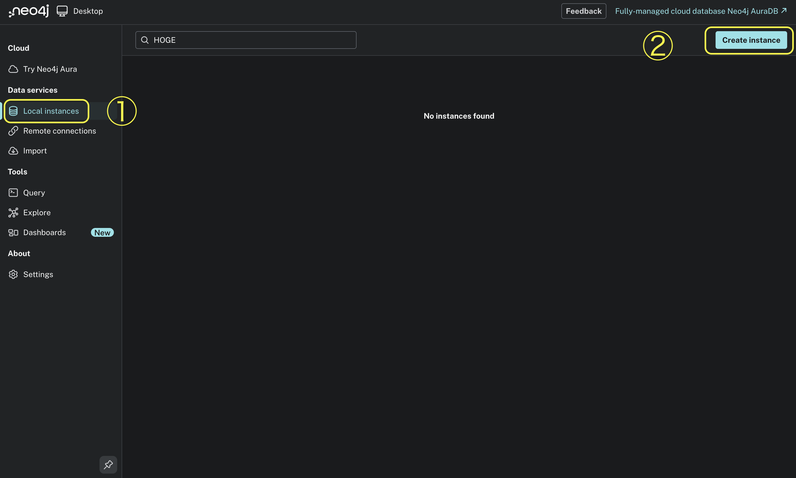
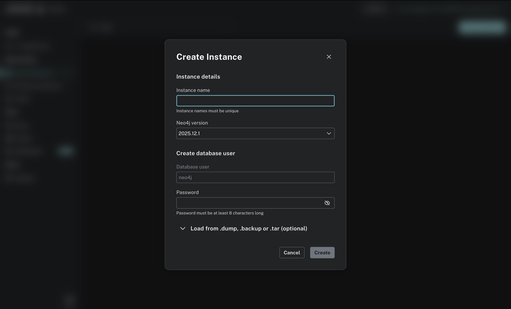
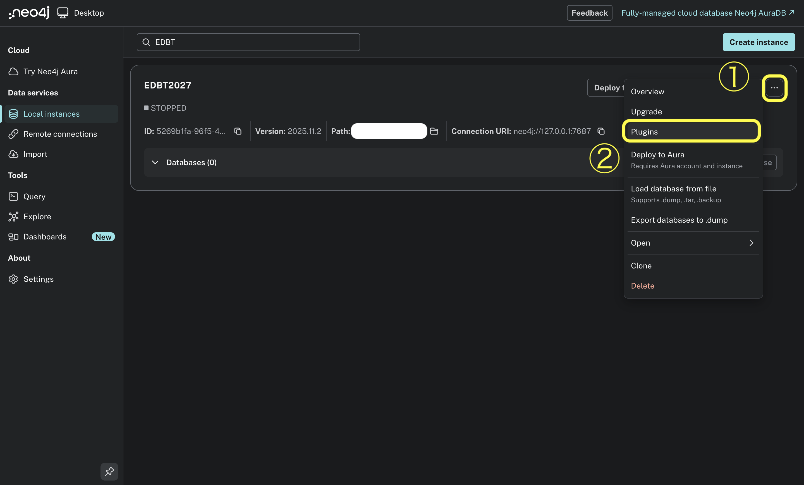
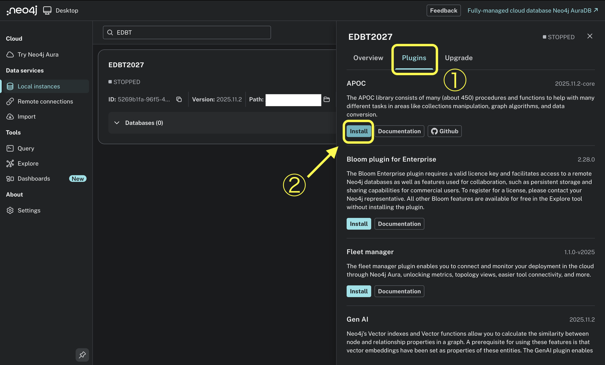
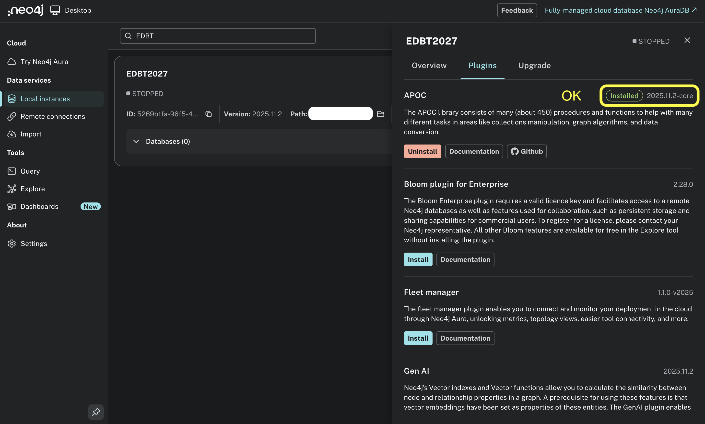
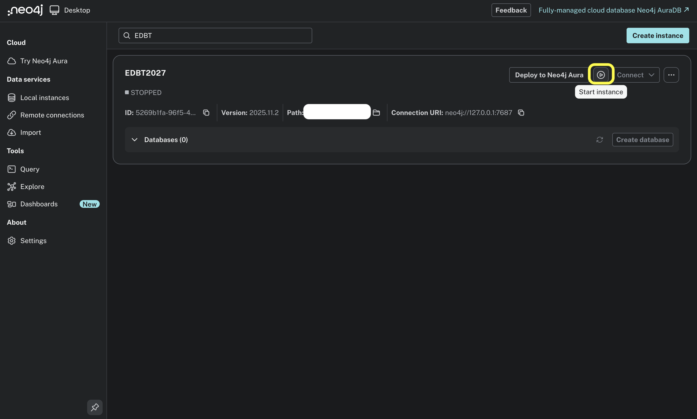
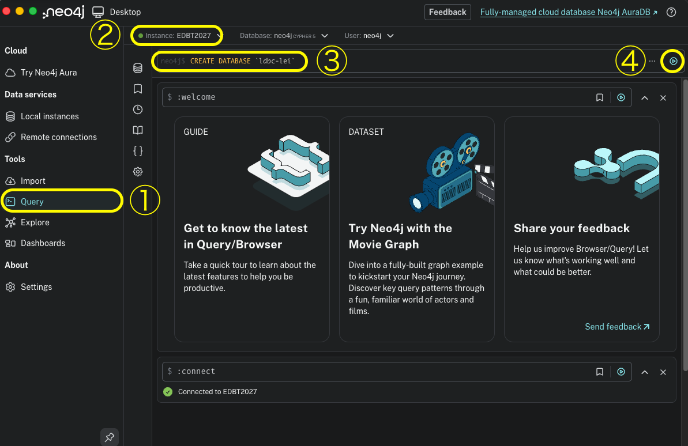
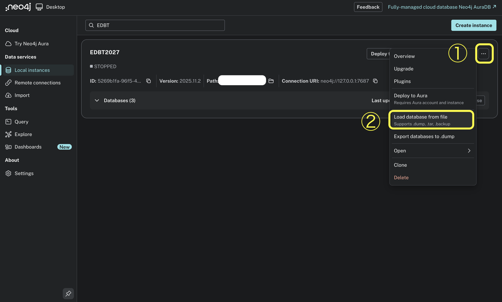
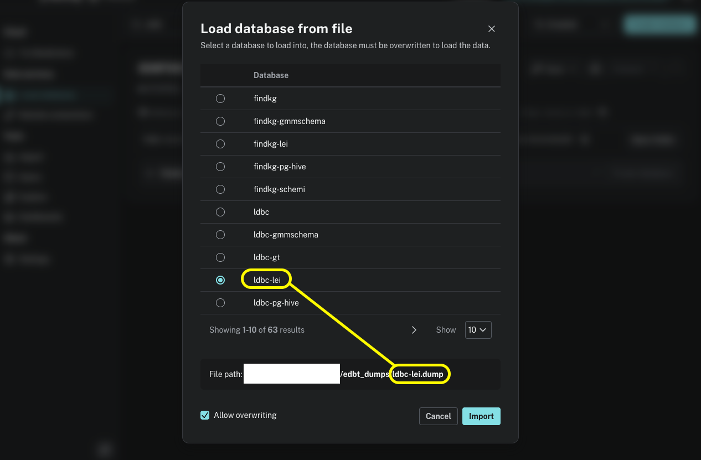

# README

## 1. Setup

### 1.1. Environment

Please install the following versions according to your environment.

**Python:** 3.12.4  
- Required libraries are listed in `requirements.txt`.
- Install them using: `pip install -r requirements.txt`

**Java:** 21.0.10

**For PG-HIVE extraction only:**

* Java: 11 (Scala 2.12 is not compatible with Java 21; e.g., `brew install openjdk@11`)
  * If JDK 11 is not at the default Homebrew path, set the `JAVA_11_HOME` environment variable.
* sbt: 1.9.9
* Scala: 2.12.17 (downloaded automatically by sbt)
* Apache Spark: 3.4.1 (resolved by sbt as a library dependency; no separate installation required)

These are required only when (re)running the PG-HIVE extraction itself.
Pre-extracted schemas for all datasets are already available in two forms:

* txt files archived in `schema_extraction/pg_hive/results/`
  (committing them to Neo4j requires only the Python environment above)
* dump files on Google Drive (see Section 1.2.4), which can be imported
  into Neo4j directly

**Neo4j:**

* Neo4j Desktop: 2.1.1
* Neo4j Instance: 2025.11.2
* APOC: 2025.11.2-core

Follow the instructions below to set up Neo4j.

---

### 1.2. Neo4j Setup and Dataset Import

#### 1.2.1. Install Neo4j Desktop

Install Neo4j Desktop from the following link:
[https://neo4j.com/deployment-center/?desktop-gdb](https://neo4j.com/deployment-center/?desktop-gdb)


#### 1.2.2. Create a Neo4j DBMS Instance

Launch Neo4j Desktop and create a new DBMS instance.



* Instance name: arbitrary (`EDBT2027` in this example)
* Neo4j version: `2025.11.2`
* Database user: `neo4j` (fixed)
* Password: `password`

Using a password other than `password` requires modifying the source code in this repository, so `password` is strongly recommended.



#### 1.2.3. Install the APOC Library

Install the APOC library into the created DBMS by following the steps shown in the images below.





#### 1.2.4. Download the Dump Files

The dump files are **not** included in this repository. They are stored on Google Drive due to size limitations; please download them from:
[https://drive.google.com/drive/folders/1CN5VVzFULPfza_Xz7PnOI8XKLAtsHnpS?usp=drive_link](https://drive.google.com/drive/folders/1CN5VVzFULPfza_Xz7PnOI8XKLAtsHnpS?usp=drive_link)

Google Drive delivers the folder as zip archive(s); extract all `.dump` files into a single directory, e.g. `~/Downloads/edbt_dumps`.

Each `xx.dump` corresponds to a database named `xx` (e.g., `mb6.dump` → `mb6`, `ldbc-sf0.1.dump` → `ldbc-sf0.1`). The databases required by each experiment are listed in Section 2; the one-shot import below populates all of them at once.

#### 1.2.5. Import the Dumps

The recommended way is the one-shot import script below, which imports all dumps in a single run; a manual GUI procedure is also described at the end of this section as an alternative.

With the DBMS of Section 1.2.2 **running**, run the import script from the repository root:

```bash
./import_dumps.sh <NEO4J_INSTANCE_DIR> [<DUMP_DIR>]
```

* `<NEO4J_INSTANCE_DIR>`: root directory of the DBMS instance, i.e. the directory containing `bin/neo4j-admin`. With Neo4j Desktop 2.x on macOS this is typically
  `~/Library/Application Support/neo4j-desktop/Application/Data/dbmss/dbms-<id>`
  (if multiple `dbms-*` directories exist, the most recently modified one is usually the instance you just created).
* `<DUMP_DIR>`: the directory with the `.dump` files downloaded in Section 1.2.4 (if omitted, `edbt_dumps/` inside this repository is assumed).

Example:

```bash
./import_dumps.sh "$HOME/Library/Application Support/neo4j-desktop/Application/Data/dbmss/dbms-<id>" "$HOME/Downloads/edbt_dumps"
```

For every `<name>.dump`, the script loads the dump via `neo4j-admin database load` and creates and starts the database `<name>`, then creates the `tmp` workspace database and verifies that all databases are online. Re-running the script is safe: existing databases are stopped, overwritten with the dump contents, and restarted.

If you changed the connection settings (Section 1.2.6), set the `NEO4J_URI` / `NEO4J_USER` / `NEO4J_PASSWORD` environment variables accordingly.

##### Manual Import via the GUI (Alternative)

You can also import the dumps one by one through the Neo4j Desktop GUI:

1. Create the target database in advance using:

   ```cypher
   CREATE DATABASE xx
   ```

   (e.g., `CREATE DATABASE ldbc-lei` for the `ldbc-lei.dump` file). Repeat this for all dumps.

   
   

2. Import `xx.dump` into database `xx`, following the images below. Also create the `tmp` workspace database (no dump; `CREATE DATABASE tmp`).




#### 1.2.6. (Optional) Neo4j Connection Settings

Default settings:

* URI: `bolt://localhost:7687`
* Username: `neo4j`
* Password: `password`

If you change these settings in Neo4j, update the connection configuration in each experiment accordingly.

---

## 2. Running Experiments

* Ensure that the Neo4j instance is running.
* Execute all commands from the root directory of this repository.

### 2.1. Experiment 1 (EQ1): Sensitivity Test

This experiment injects errors into the ground-truth schemas of the six datasets (ldbc, mb6, northwind, spotify, steam, and tpc-h).

As a prerequisite, the following databases (2 per dataset) must be populated — this is already done if you ran the one-shot import of Section 1.2.5.

`<DATASET>` ∈ {ldbc, mb6, northwind, spotify, steam, tpc-h}

| Purpose      | Database Name  | Notes                                              |
| ------------ | -------------- | -------------------------------------------------- |
| Ground truth | `<DATASET>-gt` | Ground-truth schema (e.g., `mb6-gt`, `tpc-h-gt`)   |
| Original     | `<DATASET>`    | Original instance data; shared with EQ2            |

Note: `ldbc` here refers to the EQ2 `ldbc` database, not the `ldbc-sf*` databases of EQ3.

Run the following command:

```bash
python -m experiment.sensitivity_test.main
```

Results are saved as CSV files in:

```
experiment/sensitivity_test/results
```

### 2.2. Experiment 2 (EQ2): Diagnostic Usefulness Test

This experiment evaluates the schemas extracted by the four methods (Lei, SchemI, GMMSchema, and PG-HIVE) against the original databases.

As a prerequisite, the following databases (5 per dataset + 1 workspace) must be populated — this is already done if you ran the one-shot import of Section 1.2.5. You do **not** need to run the schema extraction code yourself; see Section 4 if you want to re-generate the schemas.

`<DATASET>` ∈ {findkg, ldbc, mb6, network-management, northwind, spotify, steam, tpc-h, twitter, wordnet}

| Purpose   | Database Name         | Notes                           |
| --------- | --------------------- | ------------------------------- |
| Original  | `<DATASET>`           | e.g., `mb6`, `spotify`          |
| Lei       | `<DATASET>-lei`       | Extracted schema of Lei         |
| SchemI   | `<DATASET>-schemi`   | Extracted schema of SchemI     |
| GMMSchema | `<DATASET>-gmmschema` | Extracted schema of GMMSchema   |
| PG-HIVE   | `<DATASET>-pg-hive`   | Extracted schema of PG-HIVE     |
| Workspace | `tmp`                 | Intermediate and temporary data |

Run the following command:

```bash
python -m experiment.diagnostic_usefulness_test.main
```

Results are saved as CSV files in:

```
experiment/diagnostic_usefulness_test/results
```

### 2.3. Experiment 3 (EQ3): Scalability Test

This experiment measures the runtime of the C2-score computation on instances of increasing size: the LDBC dataset at five scale factors (`ldbc-sf0.1` … `ldbc-sf10`), plus the nine other datasets of EQ2. Each instance is evaluated against its SchemI schema, the measurement is repeated 10 times per instance, and the total elapsed time is recorded together with a per-phase breakdown (abstraction, flattening, and scoring).

As a prerequisite, the following databases (6 in addition to those of EQ2) must be populated — this is already done if you ran the one-shot import of Section 1.2.5.

| Purpose   | Database Name       | Notes                                                  |
| --------- | ------------------- | ------------------------------------------------------ |
| Target    | `ldbc-sf0.1`        | Use each SF sequentially                               |
|           | `ldbc-sf0.3`        |                                                        |
|           | `ldbc-sf1`          |                                                        |
|           | `ldbc-sf3`          |                                                        |
|           | `ldbc-sf10`         |                                                        |
| Target    | `<DATASET>`         | The nine other EQ2 original databases (all but `ldbc`) |
| Schema    | `<DATASET>-schemi` | SchemI schemas of EQ2 (incl. `ldbc-schemi`)          |
| Workspace | `tmp`               | Shared with EQ2                                        |

Note: besides the `ldbc-sf*` databases, EQ3 reuses the EQ2 databases listed above, so no additional setup is needed for them once EQ2 is prepared.

Run the following command:

```bash
python -m experiment.scalability_test.main
```

Results are saved as CSV files in:

```
experiment/scalability_test/results
```

## 3. User Study

User study materials and results are stored in the `user_study` directory:

* **Experimental scenarios:** [`user_study/questions/`](user_study/questions/) — 12 scenarios (`q1-1` … `q4-3`), each containing a PG instance (`Instance.cypher`) and four anonymized schemas (`A.cypher`–`D.cypher`). These Cypher scripts were executed in advance to materialize the instance and the four schemas as Neo4j databases; participants explored and ranked the resulting graphs through Neo4j, not by reading the Cypher files themselves.
* **Participant instructions:** [`user_study/en/README_en.md`](user_study/en/README_en.md) (English) / [`user_study/ja/README_ja.md`](user_study/ja/README_ja.md) (Japanese) — the case-study guide given to participants, with accompanying Cypher cheat sheets in the same directories.
* **Participant responses:** [`user_study/results/`](user_study/results/) — CSV files of the rankings collected from participants (`ranks.csv`).
* **Aggregation scripts:** [`user_study/scripts/`](user_study/scripts/) — scripts for computing the golden ranking via Borda count (`create_golden.py`) and Kendall's W statistics (`kendall.py`). Run them from the repository root, e.g., `python user_study/scripts/kendall.py`.

## 4. (Optional) Schema Extraction

The `schema_extraction` directory contains the implementations of the four schema extraction methods (Lei, SchemI, GMMSchema: Python; PG-HIVE: Scala/Spark).

**Note:** The extracted schemas are already provided as dump files on Google Drive (see Section 1.2.4), so running this code is **not required** to reproduce the experiments. It is included for transparency, and can of course be executed to re-generate the schemas as described below.

### 4.1. Running the Four Methods

Extract schemas and commit them to the `<DATASET>-<METHOD>` databases (e.g., `mb6-lei`) by running:

```bash
python -m schema_extraction.main
```

Target databases and methods are configured by the constants (`MODE`, `METHOD(S)`, `DB_NAME(S)`) at the top of `schema_extraction/main.py` (methods are selected by number: 1 = Lei, 2 = SchemI, 3 = GMMSchema, 4 = PG-HIVE).

### 4.2. PG-HIVE Details

PG-HIVE consists of two steps:

1. **Extraction (heavy):** run PG-HIVE (Scala/Spark) against the target Neo4j database to produce a schema txt file. The results for all datasets are already archived in `schema_extraction/pg_hive/results/`.
2. **Commit:** read the txt file and write it to the `<DATASET>-pg-hive` database. This requires only the Python environment.

By default, `schema_extraction.main` runs only the commit step, reusing the archived txt files. To re-run the extraction itself, set `PG_HIVE_EXTRACT = True` in `schema_extraction/main.py` (requires the Java 11 / sbt environment described in Section 1.1), or run it standalone:

```bash
python -m schema_extraction.pg_hive.pg_hive <DB_NAME> --extract
```
