# User Study Guide

## Table of Contents
- [1. What is a Property Graph?](#1-what-is-a-property-graph)
- [2. What is a Schema?](#2-what-is-a-schema)
- [3. Task Overview](#3-task-overview)
- [4. Joining the Experiment Database](#4-joining-the-experiment-database)
- [5. Neo4j Basics](#5-neo4j-basics)
- [6. Example Evaluation](#6-example-evaluation)
- [7. Importing the Cypher Cheat Sheet](#7-importing-the-cypher-cheat-sheet)
---

## 1. What is a Property Graph?
Information around us is often about **relationships**—people follow people, users create posts, customers purchase products.  
In a traditional relational database (RDB), these relationships are stored across multiple tables. Querying complex structures typically requires several `JOIN`s, which can make SQL complicated and slow.

For example, to find “posts liked by users who follow A,” you would need to join:
- a `User` table
- a `Follow` table
- a `Post` table
- a `Like` table

A **graph data model** expresses such relationships more naturally. Data is represented as **nodes (vertices)** and **edges (relationships)**, letting you literally draw who connects to what and how—for example, “A ←(FOLLOWS)- B -(LIKES)→ Post X,” which is easy to grasp at a glance.

Among graph models, the **Property Graph** is both flexible and expressive.  
Both nodes and edges can carry **labels** (coarse-grained types) and **properties** (key–value attributes). For instance, a node may carry a `Person` label; a `LIKES` edge can carry a `timestamp` property recording when the like occurred.

Figure 1 shows a property graph representing follow relationships between users and authorship of posts. Because property graphs capture complex relationships intuitively, they are widely used in social-network analysis, recommender systems, and knowledge graphs. The sections below explain each element using Figure 1.

<figure>
  <div align="center">
    
    <p><strong>Figure 1: Example of a property graph</strong></p>
  </div>
</figure>

### (1) Nodes
In Figure 1, $n_1, n_2, \cdots , n_5$ are nodes.  
Nodes represent entities such as people, places, things, or abstract concepts.

### (2) Edges
In Figure 1, $e_1, e_2, \cdots, e_7$ are edges.  
Edges indicate relationships between nodes. In this graph, edges are **directed** and are drawn as arrows from a source node to a target node.

### (3) Labels
In Figure 1, node labels include `Person` and `Student`; edge labels include `FOLLOWS` and `CREATES`.  
Labels indicate coarse-grained types. A node or edge may have zero or more labels.

### (4) Properties
Examples include node $n_1$ having `name: "Alice"` and `age: 18`, and edge $e_4$ having `ts: 01-12-10:00`.  
Property names such as `name` or `age` are **keys**; values such as `"Alice"` or `18` are **values**.  
Nodes and edges may carry zero or more properties.

---

## 2. What is a Schema?
In a property graph, you model data using nodes and edges, each optionally carrying labels and properties. As a dataset grows, **without agreed rules**—what node/edge types exist and which labels/properties they should have—the structure can drift, hurting consistency and query performance.

A **schema** is the blueprint and rulebook for your graph. It defines what kinds of nodes and edges exist and which information each can or must carry. With a schema, you can keep the data **consistent** and **coherent**.

Consider a social network:
- Users are nodes with the `Person` label and properties like `name` and `age`.
- Posts are nodes with the `Post` label and a `text` property.
- `LIKES` edges connect users to posts and may carry a `timestamp` indicating when the like occurred.

By defining a schema, you make it clear which node types can connect to which, and which properties are required vs. optional. This clarity improves data integrity, enables validation, and helps query optimization.

Schemas may also define **type inheritance**. For instance, you can derive `Student` or `BusinessAccount` from a base `Person` type—reusing shared constraints while organizing and extending the model cleanly.

Figure 2 shows a schema corresponding to the property graph in Figure 1.  
It consists of **node types** and **edge types**, each carrying information such as label constraints, property constraints, and (for edge types) **endpoint constraints**. We explain each using Figure 2 below.

<div style="display: flex; justify-content: space-around; align-items: flex-start;">
  <figure style="margin: 0 10px;">
    <div align="center">
      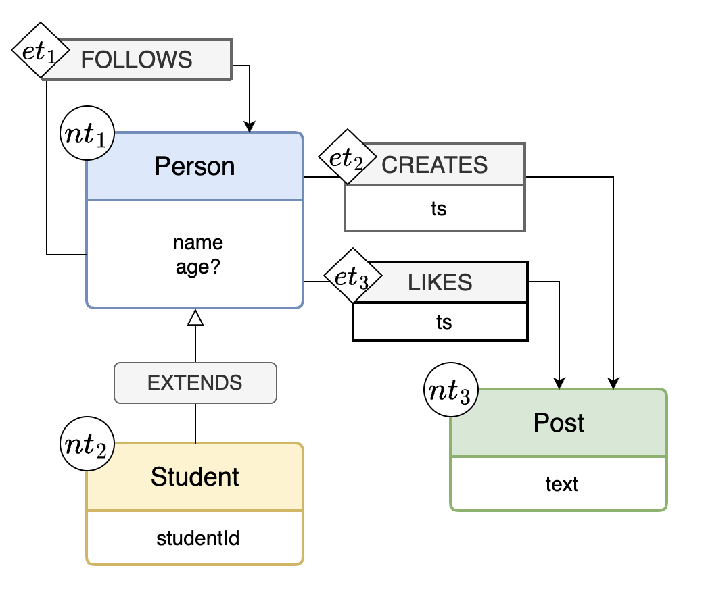
      <p><strong>Figure 2: Example schema</strong></p>
    </div>
  </figure>
  <figure style="margin: 0 10px;">
    <div align="center">
      
      <p><strong>(Reprise) Figure 1: Property graph</strong></p>
    </div>
  </figure>
</div>

### (1) Node types
Node types contain:
- **Label constraints**
  - Required labels
  - Optional labels (omitted in this study)
- **Property constraints**
  - Required properties
  - Optional properties (shown with a trailing `?` in figures)

For example, node type $nt_1$ in Figure 2 has:
- Required label: `Person`
- Required property: `name`
- Optional property: `age`

Nodes $n_1$ and $n_2$ in Figure 1 satisfy the constraints of node type $nt_1$.

### (2) Edge types
Edge types contain:
- **Label constraints**
  - Required labels
  - Optional labels (omitted in this study)
- **Property constraints**
  - Required properties
  - Optional properties
- **Endpoint constraints** specifying which node types the edge connects:
  - **Source node type** (what types can be sources)
  - **Target node type** (what types can be targets)

For example, edge type $et_2$ in Figure 2 has:
- Required label: `CREATES`
- Required properties: `ts`
- Optional properties: none
- Endpoints:
  - Source node type: $nt_1$
  - Target node type: $nt_3$

Edge $e_4$ in Figure 1 satisfies the constraints of $et_2$.

### (3) Inheritance of node types
**Inheritance** means a node type can extend another type’s labels and property constraints. For instance, from a base type with label `Person`, you may derive `Student` or `Teacher` types.

Inheritance is depicted using a special `EXTENDS` edge: the **child** node type is the source, and the **parent** node type is the target.

When node type inheritance is used, two rules apply:
- **Rule 1.** A child node type inherits all label and property constraints from its parent.
- **Rule 2.** Any edge type whose endpoint constraints include the parent also implicitly includes the child as an endpoint.

#### Concrete example
Figure 3 extracts a subset of node and edge types from Figure 2 and highlights inheritance.

<div style="display: flex; justify-content: space-around; align-items: flex-start;">
  <figure style="margin: 0 10px;">
    <div align="center">
      
      <p><strong>Figure 3: Subgraph of the schema in Figure 2</strong></p>
    </div>
  </figure>
  <figure style="margin: 0 10px;">
    <div align="center">
      
      <p><strong>Figure 4: Schema after expanding the inheritance in Figure 3</strong></p>
    </div>
  </figure>
</div>

Child node type $nt_2$ inherits from parent $nt_1$. By Rule 1, the child ($nt_2$) inherits:
- Required label: `Person`
- Required property: `name`
- Optional property: `age`

By Rule 2, endpoint constraints that mention the parent ($nt_1$) also extend to the child ($nt_2$). For example, if $et_2$ accepts $nt_1$ as a source, it also accepts $nt_2$ as a source.

Replacing inheritance with the equivalent explicit structure is called **expansion**. Expanding Figure 3 yields Figure 4. The `EXTENDS` edge is removed, and child types directly include the parent’s constraints. For instance, node type $nt_5$ in Figure 4 carries its original required label `Student`, plus the labels/properties inherited from $nt_1$.

Figures 3 and 4 express the **same meaning**, but Figure 4 is more verbose. Expanded schemas are also harder to maintain: if you add a new required property `email` to $nt_4$ in Figure 4, you must also add it to $nt_5$. In contrast, in Figure 2 you would add `email` only to $nt_1$, and the child types inherit it automatically.

Thus, inheritance keeps schemas concise and maintains them more easily.

### (4) Inheritance of edge types
Not used in this study.

### (5) Notes
- Other schema concepts (edge cardinality such as 1–1, 1–N, N–N, uniqueness constraints, etc.) are out of scope for this study.
- For reference, Figure 5 shows the expanded version of Figure 2.

<div style="display: flex; justify-content: space-around; align-items: flex-start;">
  <figure style="margin: 0 10px;">
    <div align="center">
      
      <p><strong>(Reprise) Figure 2: Example schema</strong></p>
    </div>
  </figure>
  <figure style="margin: 0 10px;">
    <div align="center">
      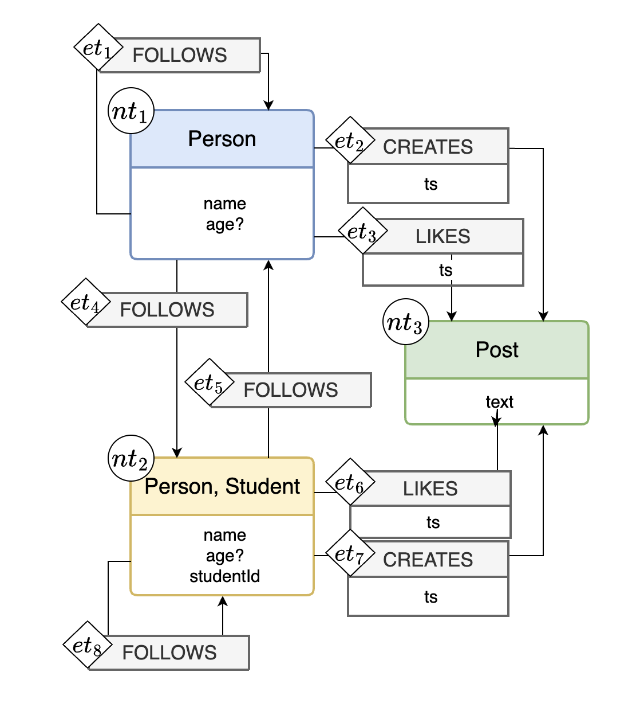
      <p><strong>Figure 5: Expanded version of Figure 2</strong></p>
    </div>
  </figure>
</div>

---
## 3. Task Overview

In this study, you will compare a given dataset with **multiple candidate schemas** and **evaluate which schema best fits** the data.

### What you will receive
- One dataset and **four** schemas (A, B, C, D).  
- The dataset is **correct**—there are no missing or erroneous values. Therefore, if a schema conflicts with the dataset, **assume the schema is at fault**.

### Your tasks
1. **Rank** the schemas by how accurately they model the data.  
   - Rank from 1 (best) to 4 (worst).  
   - No ties—assign a unique rank to each (1, 2, 3, 4).

2. **Briefly justify your ranking.**  
   For example: “Schema A matches X and Y in the data, while Schema B conflicts with Z; therefore A is better.” Short reasons are sufficient; you do **not** need to detail every point for every schema.

Please submit your answer using the Google Form below:

https://forms.gle/7yfz1hnqs36hYtZw8

### What to look for
Use any of the following as helpful (not mandatory) guidelines:
- Do node/edge labels and properties align with the data?
- Are required/optional properties modeled appropriately?
- Are inheritance relations used appropriately?
- Does the overall schema represent the data structure clearly?

When assigning ranks, consider:
- **Number of mistakes:** fewer errors → higher rank
- **Severity of mistakes:** fewer critical errors → higher rank

There is **no single correct answer**. We aim to understand how users judge schema validity. Please provide your **honest, intuitive assessment**.

### Important notes
- Do **not** upload graph data to a generative AI tool or ask it to perform the evaluation.
- You **may** use Cypher queries to help evaluate the graph, and you may use a generative AI tool to **create queries**.  
  - However, do **not** ask a generative AI to pick or evaluate schemas for you.

---
## 4. Joining the Experiment Database

This study uses **Neo4j Aura**, the managed cloud service for the Neo4j graph database.

1. You will receive an email like Figure 6. Click **“Join your team.”**  
   - Subject: *Join the PG schema evaluation team in Neo4j Aura*

<figure style="margin: 0 10px;">
  <div align="center">
    
    <p><strong>Figure 6: Join your team screen</strong></p>
  </div>
</figure>

2. Your browser opens a page like Figure 7. Click **“Continue”** and complete account registration.

<figure style="margin: 0 10px;">
  <div align="center">
    
    <p><strong>Figure 7: Neo4j Aura account registration</strong></p>
  </div>
</figure>

3. If you see Figure 8, you are all set.

<figure style="margin: 0 10px;">
  <div align="center">
    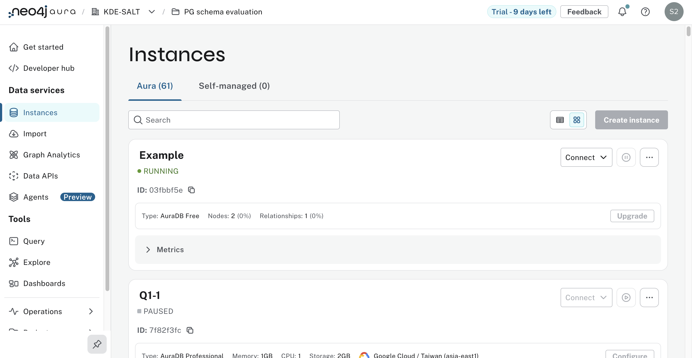
    <p><strong>Figure 8</strong></p>
  </div>
</figure>

---
## 5. Neo4j Basics

### Connecting to Neo4j Browser
If you haven’t registered with Neo4j Aura yet, complete the steps in [4. Joining the Experiment Database](#4-joining-the-experiment-database).  
For subsequent logins, go to <https://console.neo4j.io/>, click **Log in** under the **Continue** button.

### Connecting to the database instance
After logging in, you’ll see a list of instances like Figure 9. This guide uses an instance named **Example**. Click **Connect → Query** on the right.

<figure style="margin: 0 10px;">
  <div align="center">
    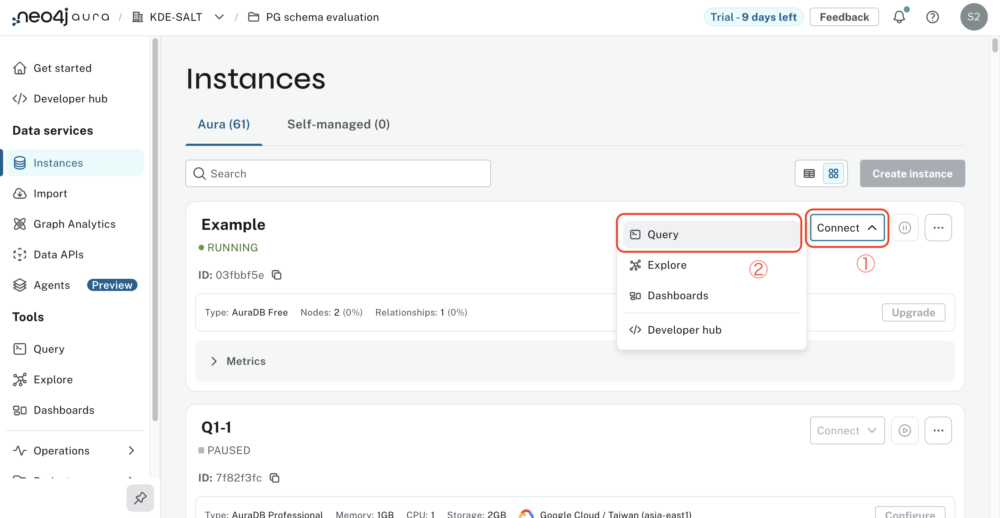
    <p><strong>Figure 9: Instances list</strong></p>
  </div>
</figure>

If no instances appear (Figure 10), your **Organization** selection may be incorrect. Use the tabs at the top to switch organizations.

<figure style="margin: 0 10px;">
  <div align="center">
    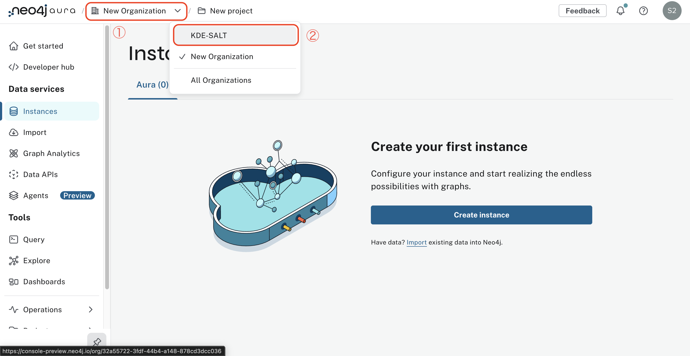
    <p><strong>Figure 10: No instances displayed</strong></p>
  </div>
</figure>

### Understanding the interface
When connected, you’ll see a screen like Figure 11.
- The left pane lists counts of nodes/edges and all labels and properties.
- The top area contains a text box for Cypher queries; Figure 11 shows a blank state (no query yet).

<figure style="margin: 0 10px;">
  <div align="center">
    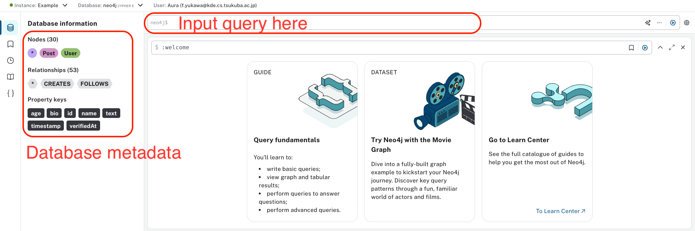
    <p><strong>Figure 11: Immediately after connecting</strong></p>
  </div>
</figure>


Figure 12 shows a node selected after running a Cypher query. Try executing the following query—it returns all nodes and edges:

```cypher
MATCH (n)
OPTIONAL MATCH (n)-[r]->(m)
RETURN n, r, m
```

- The center shows query results, rendered as a graph by default.  
  - Colored circles are nodes; arrows are edges.  
  - You can freely drag nodes/edges. **When comparing schemas, aligning elements by drag can improve readability.**
- Clicking a node/edge shows details on the right.  
  - In the example, the selected node has label `User` and properties `{id: "u001", name: "Alice"}`.  
  - ⚠️ **`<id>` property is an internal Neo4j node ID. It has no meaning for this study—please ignore it.**
- Use the view buttons at the top-left of the result pane to switch views.  
  - Clicking **Table** switches to a tabular view (Figure 13).
- 

<figure style="margin: 0 10px;">
  <div align="center">
    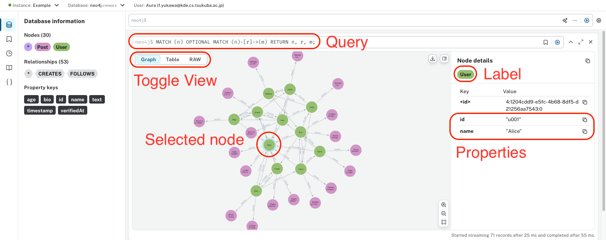
    <p><strong>Figure 12: After running a query and selecting a node</strong></p>
  </div>
</figure>

<figure style="margin: 0 10px;">
  <div align="center">
    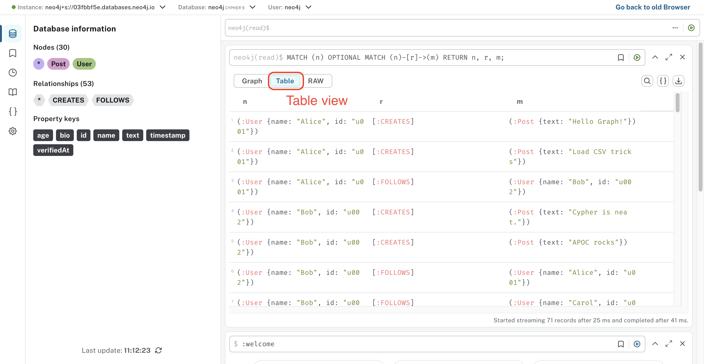
    <p><strong>Figure 13: Table view</strong></p>
  </div>
</figure>

---
## 6. Example Evaluation

In the real task, each question provides one dataset and **four** candidate schemas to compare. For simplicity, this example uses one dataset and **two** schemas.

### Dataset and schemas
Assume the dataset contains two nodes and one edge:

Nodes:
- Label `Person`, properties `{name: "Alice", age: 22}`
- Label `Person`, properties `{name: "Bob"}`

Edge:
- Label `LIKES`, **no** properties

Loaded into Neo4j, this appears as in Figure 14.

<figure>
  <div align="center">
    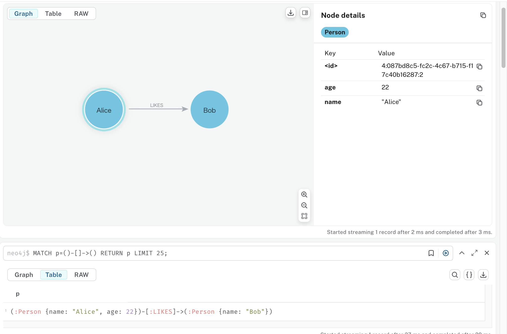
    <p><strong>Figure 14: Example data</strong></p>
  </div>
</figure>

Two candidate schemas A and B:

- **Schema A (Figure 15)**  
  - Node type: required label `Person`, required property `name`, **optional** property `age`  
  - Edge type: required label `LIKES`, no properties, endpoints (source `Person`, target `Person`)

- **Schema B (Figure 16)**  
  - Node type: required label `Person`, required property `name`, **required** property `age`  
  - Edge type: required label `LIKES`, no properties, endpoints (source `Person`, target `Person`)

The only difference is whether `age` is optional or required.

<figure>
  <div align="center">
    
    <p><strong>Figure 15: Schema A</strong></p>
  </div>
</figure>

<figure>
  <div align="center">
    
    <p><strong>Figure 16: Schema B</strong></p>
  </div>
</figure>

### Evaluating the schemas
Both schemas define the same `LIKES` edge type, which matches the data, so focus on the `Person` node type.  
In the data, `Alice` has an `age`, but `Bob` does not. Therefore:
- Schema A fits **all** nodes.
- Schema B violates the constraint for `Bob` (missing required `age`).

Hence, **Schema A is more appropriate**.

*Note: This is just an example. Your own evaluation need not follow this exact reasoning.*

---

## 7. Tips

### (1) Importing the Cypher Cheat Sheet

In the previous example, the dataset was very small, so it was easy to visually determine which node properties were required or optional.  
However, when working with larger datasets, it becomes difficult to make such judgments by eye.  
In those cases, the **Cypher Cheat Sheet** can be very useful.

The Cypher Cheat Sheet contains a collection of queries that may help you evaluate schemas more efficiently.

#### How to Import the Cypher Cheat Sheet

1. Download the `cypher_cheat_sheet_XX.csv` file from the GitHub repository. (`XX = ja | en`)
2. In the Neo4j Browser, click the bookmark icon (①) on the left sidebar, then click the upload icon (②), as shown in Figure 17.
   <figure>
    <div align="center">
      
      <p><strong>Figure 17: Neo4j Browser Interface</strong></p>
    </div>
   </figure>

3. When the file selection dialog appears, choose the `cypher_cheat_sheet_XX.csv` file you downloaded.
4. If a dialog appears indicating that the import was successful (Figure 18), the process is complete.

<figure>
  <div align="center">
    
    <p><strong>Figure 18: Cypher Cheat Sheet Import Complete</strong></p>
  </div>
</figure>

#### How to Use the Cypher Cheat Sheet

Clicking on any query shown in Figure 18 will automatically insert that query into the Cypher query editor (Figure 19).  
This allows you to quickly access frequently used queries, which can help streamline your schema evaluation.

<figure>
  <div align="center">
    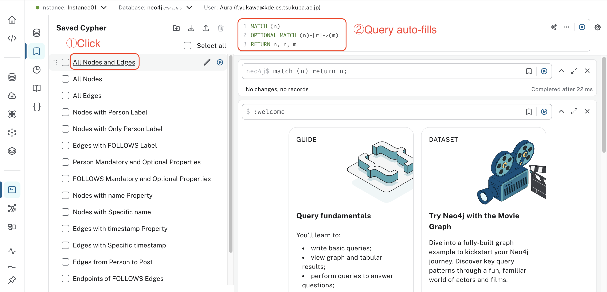
    <p><strong>Figure 19: Example of a Cypher Cheat Sheet Query</strong></p>
  </div>
</figure>

#### Saving Your Own Queries

You can also bookmark your own custom queries.  
As shown in Figure 20, click the three-dot menu in the upper-right corner of the query editor and select **"Save cypher"**.  
In the following dialog (Figure 21), enter a name of your choice.  
Your saved query will then appear under “Saved Cypher,” as shown in Figure 22.

<figure>
  <div align="center">
    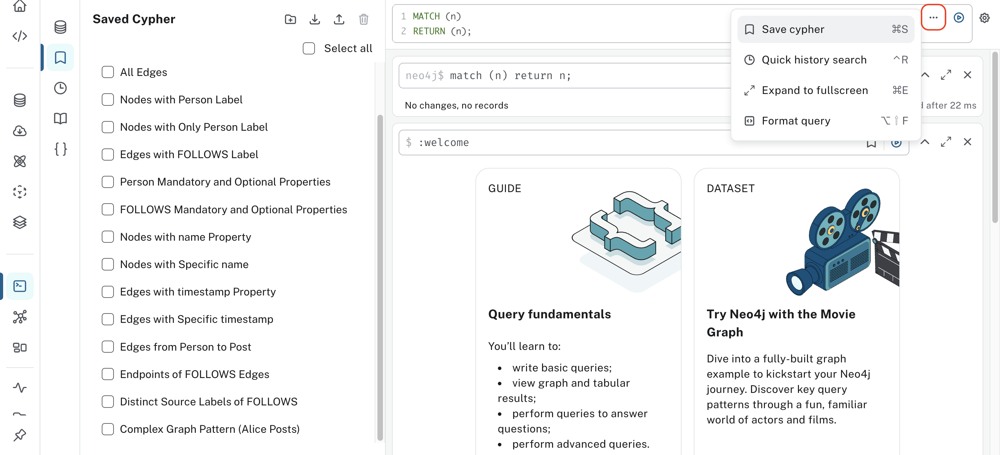
    <p><strong>Figure 20</strong></p>
  </div>
</figure>

<figure>
  <div align="center">
    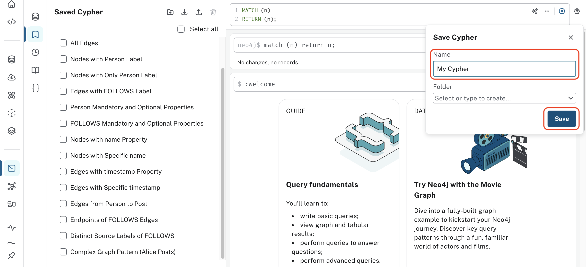
    <p><strong>Figure 21</strong></p>
  </div>
</figure>

<figure>
  <div align="center">
    
    <p><strong>Figure 22</strong></p>
  </div>
</figure>

#### Notes

- Saved Cypher entries are stored per user, so feel free to save or delete anything as needed.
- Saved Cypher entries remain available even if you close the Neo4j Browser.

---

### (2) Duplicating the Query Window

In this user study, you will need to compare the data with the schema candidates.  
To make this easier, we recommend keeping **both the data view and the schema views open in separate browser tabs**.

To do this, open the page shown in Figure 23  
(`console-preview.neo4j.io/projects/32a55722-3fdf-44b4-a148-878cd3dcc036/instances`)  
in multiple browser tabs, and display the data (e.g., Q1-1) and schema candidates (e.g., Q1-1-A, Q1-1-B, etc.) side by side, as shown in Figure 24.

<figure>
  <div align="center">
    
    <p><strong>Figure 23</strong></p>
  </div>
</figure>

<figure>
  <div align="center">
    
    <p><strong>Figure 24</strong></p>
  </div>
</figure>
