# Follow-up User Study: Ranking Candidate Schemas

This is a follow-up to the user study you may have participated in before.
No Neo4j access is needed this time: please answer via Google Form using only
the figures and tables in this document. Expected time: 25-30 minutes.

## Table of Contents
- [0. Before you start](#0-before-you-start)
- [1. What is a Property Graph?](#1-what-is-a-property-graph)
- [2. What is a Schema?](#2-what-is-a-schema)
- [3. Your task](#3-your-task)
- [Task 1 (Q5-1): Music](#task-1-q5-1-music)
- [Task 2 (Q5-2): Academic publications](#task-2-q5-2-academic-publications)
- [Task 3 (Q5-3): E-commerce](#task-3-q5-3-e-commerce)
- [Thank you](#thank-you)
---

## 0. Before you start

Please check the following four points before answering.

- **⏱ Please measure how long this takes you.**
  **Start the clock when you begin working on Task 1**, and enter the **total
  time you spent** in the Google Form. The time you spend reading the
  explanations up to that point (property graphs, schemas, the task
  description) does **not** count; time spent re-reading them **after** you
  have started a task **does** count.
  If you answer all three tasks in one sitting, report the time from start to
  finish; if you split the work over several sittings, report the **sum of
  those sittings** (a rough figure in minutes is fine).
- **Submit the Google Form distributed to participants by the announced deadline.**
- **Do not use generative AI (ChatGPT or other LLMs).**
  Do not feed the graphs or schemas of this document into a generative AI, and do
  not ask an AI to rank or evaluate them.
- **Answer all three tasks.**
  A response that leaves any task unanswered is **invalid** and cannot be used
  in the analysis.

---

## 1. What is a Property Graph?
Information around us is often about **relationships**—people follow people, users create posts, customers purchase products.  
In a traditional relational database (RDB), these relationships are stored across multiple tables. Querying complex structures typically requires several `JOIN`s, which can make SQL complicated and slow.

For example, to find “posts liked by users who follow A,” you would need to join:
- a `User` table
- a `Follow` table
- a `Post` table
- a `Like` table

A **graph data model** expresses such relationships more naturally. Data is represented as **nodes (vertices)** and **edges (relationships)**, letting you literally draw who connects to what and how—for example, “A ←(FOLLOWS)- B -(LIKES)→ Post X,” which is easy to grasp at a glance.

Among graph models, the **Property Graph** is both flexible and expressive.  
Both nodes and edges can carry **labels** (coarse-grained types) and **properties** (key–value attributes). For instance, a node may carry a `Person` label; a `LIKES` edge can carry a `timestamp` property recording when the like occurred.

Figure 1 shows a property graph representing follow relationships between users and authorship of posts. Because property graphs capture complex relationships intuitively, they are widely used in social-network analysis, recommender systems, and knowledge graphs. The sections below explain each element using Figure 1.

<figure>
  

    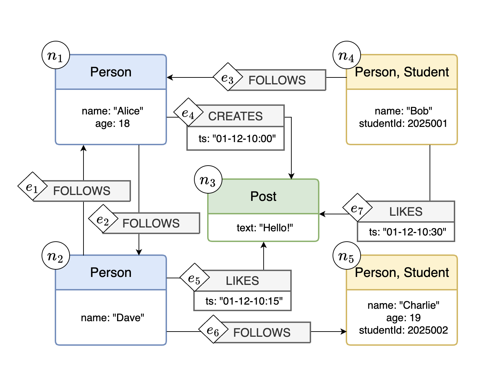
    
<strong>Figure 1: Example of a property graph</strong>

  

</figure>

### (1) Nodes
In Figure 1, $n_1, n_2, \cdots , n_5$ are nodes.  
Nodes represent entities such as people, places, things, or abstract concepts.

### (2) Edges
In Figure 1, $e_1, e_2, \cdots, e_7$ are edges.  
Edges indicate relationships between nodes. In this graph, edges are **directed** and are drawn as arrows from a source node to a target node.

### (3) Labels
In Figure 1, node labels include `Person` and `Student`; edge labels include `FOLLOWS` and `CREATES`.  
Labels indicate coarse-grained types. A node or edge may have zero or more labels.

### (4) Properties
Examples include node $n_1$ having `name: "Alice"` and `age: 18`, and edge $e_4$ having `ts: 01-12-10:00`.  
Property names such as `name` or `age` are **keys**; values such as `"Alice"` or `18` are **values**.  
Nodes and edges may carry zero or more properties.

---

## 2. What is a Schema?
In a property graph, you model data using nodes and edges, each optionally carrying labels and properties. As a dataset grows, **without agreed rules**—what node/edge types exist and which labels/properties they should have—the structure can drift, hurting consistency and query performance.

A **schema** is the blueprint and rulebook for your graph. It defines what kinds of nodes and edges exist and which information each can or must carry. With a schema, you can keep the data **consistent** and **coherent**.

Consider a social network:
- Users are nodes with the `Person` label and properties like `name` and `age`.
- Posts are nodes with the `Post` label and a `text` property.
- `LIKES` edges connect users to posts and may carry a `timestamp` indicating when the like occurred.

By defining a schema, you make it clear which node types can connect to which, and which properties are required vs. optional. This clarity improves data integrity, enables validation, and helps query optimization.

Schemas may also define **type inheritance**. For instance, you can derive `Student` or `BusinessAccount` from a base `Person` type—reusing shared constraints while organizing and extending the model cleanly.

Figure 2 shows a schema corresponding to the property graph in Figure 1.  
It consists of **node types** and **edge types**, each carrying information such as label constraints, property constraints, and (for edge types) **endpoint constraints**. We explain each using Figure 2 below.

<table>
  <tr>
    <td align="center" valign="top">
      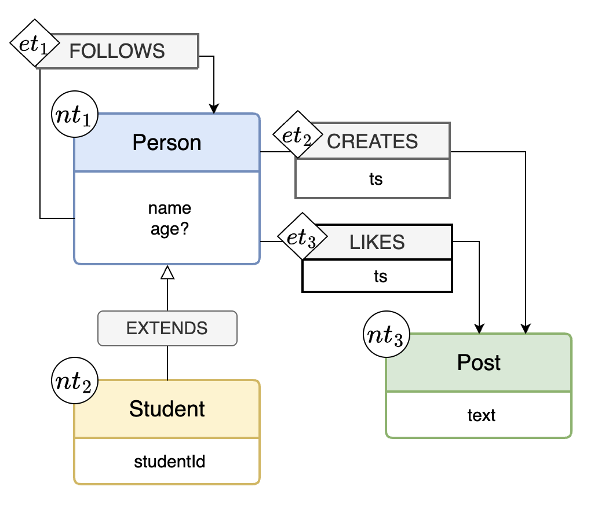 
      <strong>Figure 2: Example schema</strong>
    </td>
    <td align="center" valign="top">
       
      <strong>(Reprise) Figure 1: Property graph</strong>
    </td>
  </tr>
</table>

### (1) Node types
Node types contain:
- **Label constraints**
  - Required labels
  - Optional labels (omitted in this study)
- **Property constraints**
  - Required properties
  - Optional properties (shown with a trailing `?` in figures)

For example, node type $nt_1$ in Figure 2 has:
- Required label: `Person`
- Required property: `name`
- Optional property: `age`

Nodes $n_1$ and $n_2$ in Figure 1 satisfy the constraints of node type $nt_1$.

### (2) Edge types
Edge types contain:
- **Label constraints**
  - Required labels
  - Optional labels (omitted in this study)
- **Property constraints**
  - Required properties
  - Optional properties
- **Endpoint constraints** specifying which node types the edge connects:
  - **Source node type** (what types can be sources)
  - **Target node type** (what types can be targets)

For example, edge type $et_2$ in Figure 2 has:
- Required label: `CREATES`
- Required properties: `ts`
- Optional properties: none
- Endpoints:
  - Source node type: $nt_1$
  - Target node type: $nt_3$

Edge $e_4$ in Figure 1 satisfies the constraints of $et_2$.

### (3) Inheritance of node types
**Inheritance** means a node type can extend another type’s labels and property constraints. For instance, from a base type with label `Person`, you may derive `Student` or `Teacher` types.

Inheritance is depicted using a special `EXTENDS` edge: the **child** node type is the source, and the **parent** node type is the target.

When node type inheritance is used, two rules apply:
- **Rule 1.** A child node type inherits all label and property constraints from its parent.
- **Rule 2.** Any edge type whose endpoint constraints include the parent also implicitly includes the child as an endpoint.

#### Concrete example
Figure 3 extracts a subset of node and edge types from Figure 2 and highlights inheritance.

<table>
  <tr>
    <td align="center" valign="top">
      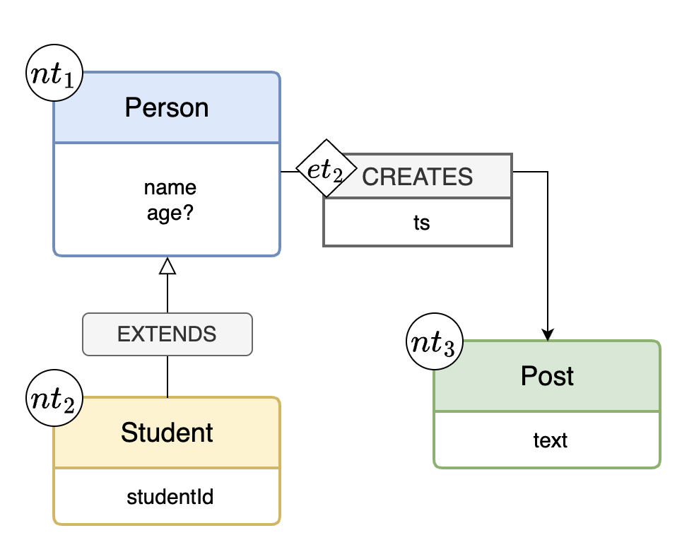 
      <strong>Figure 3: Subgraph of the schema in Figure 2</strong>
    </td>
    <td align="center" valign="top">
      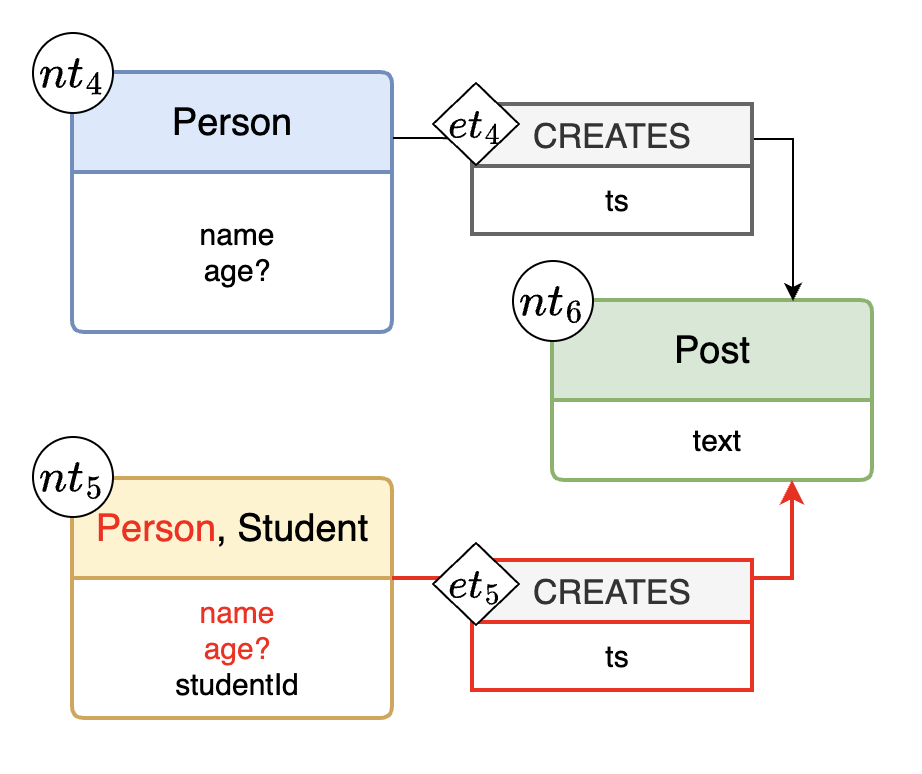 
      <strong>Figure 4: Schema after expanding the inheritance in Figure 3</strong>
    </td>
  </tr>
</table>

Child node type $nt_2$ inherits from parent $nt_1$. By Rule 1, the child ($nt_2$) inherits:
- Required label: `Person`
- Required property: `name`
- Optional property: `age`

By Rule 2, endpoint constraints that mention the parent ($nt_1$) also extend to the child ($nt_2$). For example, if $et_2$ accepts $nt_1$ as a source, it also accepts $nt_2$ as a source.

Replacing inheritance with the equivalent explicit structure is called **expansion**. Expanding Figure 3 yields Figure 4. The `EXTENDS` edge is removed, and child types directly include the parent’s constraints. For instance, node type $nt_5$ in Figure 4 carries its original required label `Student`, plus the labels/properties inherited from $nt_1$.

Figures 3 and 4 express the **same meaning**, but Figure 4 is more verbose. Expanded schemas are also harder to maintain: if you add a new required property `email` to $nt_4$ in Figure 4, you must also add it to $nt_5$. In contrast, in Figure 2 you would add `email` only to $nt_1$, and the child types inherit it automatically.

Thus, inheritance keeps schemas concise and maintains them more easily.

### (4) Inheritance of edge types
Not used in this study.

### (5) Notes
- Other schema concepts (edge cardinality such as 1–1, 1–N, N–N, uniqueness constraints, etc.) are out of scope for this study.
- For reference, Figure 5 shows the expanded version of Figure 2.

<table>
  <tr>
    <td align="center" valign="top">
       
      <strong>(Reprise) Figure 2: Example schema</strong>
    </td>
    <td align="center" valign="top">
      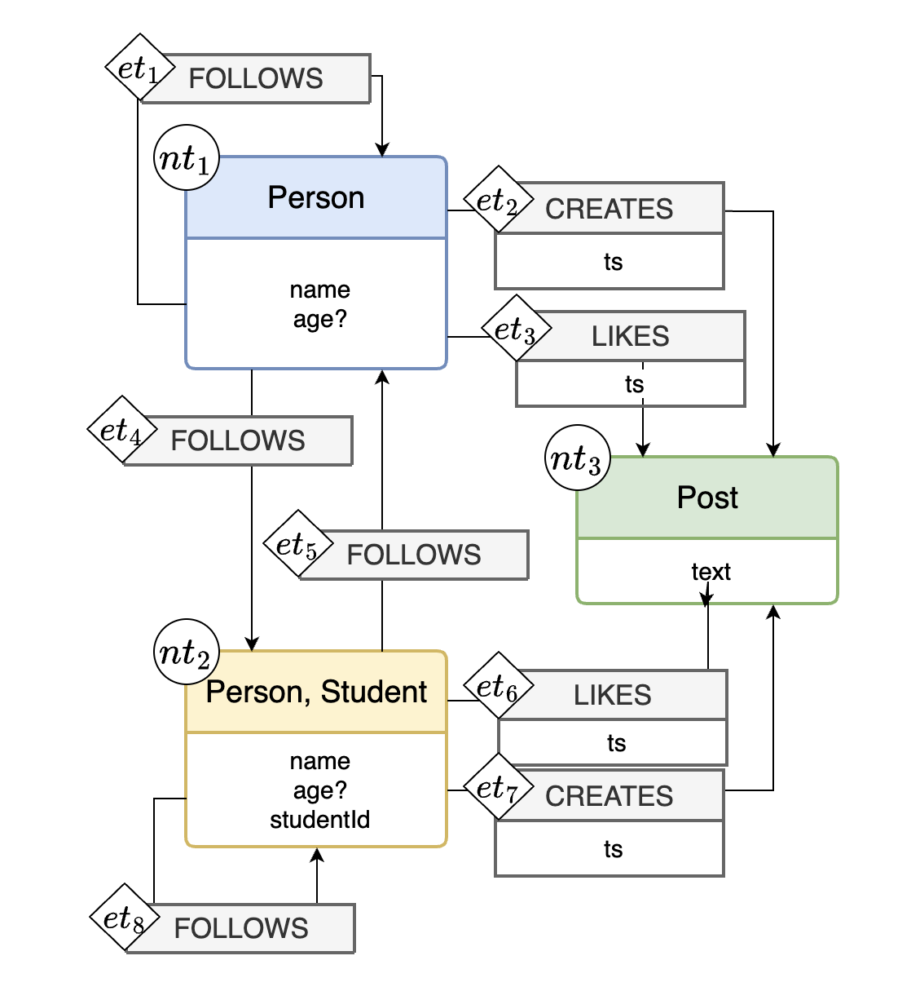 
      <strong>Figure 5: Expanded version of Figure 2</strong>
    </td>
  </tr>
</table>

---

## 3. Your task

Below are **3 tasks**. Each presents **one graph** (a figure plus node and
edge tables) and **four candidate schemas (A-D)**.

Every node of the data carries a **node id** such as `Album #1` (its labels
plus a running number). The box header in the figure and the ids in the node
and edge tables refer to the same node.

- The data is correct and complete. **If a schema disagrees with the data,
  the schema is wrong.**
- For each task, **rank the four candidates from 1 (best) to 4 (worst)**
  by how appropriately they describe the graph. **No ties** are allowed.
- There is no "correct answer"; please answer with your honest intuition.

Aspects you may consider (any other viewpoint is also fine):

- Do the labels and properties of node/edge types agree with the data?
- Does the mandatory/optional (`?`) distinction match the data?
- Are edge endpoints (arrow direction, connected types) correct?
- Fewer errors, and less severe errors, deserve a higher rank.

### Measuring your time

**Start the clock when you begin working on Task 1 below.** The time you spend
reading the explanations up to this point (§1 property graphs, §2 schemas and
this task description) does **not** count. Time spent re-reading them **after**
you have started a task **does** count.
Report the time from start to finish if you answer all three tasks in one
sitting, or the sum of the sittings if you split the work, in the Google Form
(a rough figure in minutes is fine).

### Notes

- Please do not feed the graphs or schemas in this document into a generative
  AI, or ask an AI to evaluate them.
- Answers are collected via the Google Form distributed to participants.
  The form asks one rank (1-4) per candidate, keyed like `Q5-1-A`.

---

> [!IMPORTANT]
> **⏱ The tasks start here. Please start measuring your time.**
>
> Before you begin Task 1, start a timer or note down the current time.
> The time you spent reading the explanations above (§1, §2, §3) does not count.
> Once you have finished all three tasks, report the total time in the Google Form
> (a rough figure in minutes is fine).

## Task 1 (Q5-1): Music

### Data

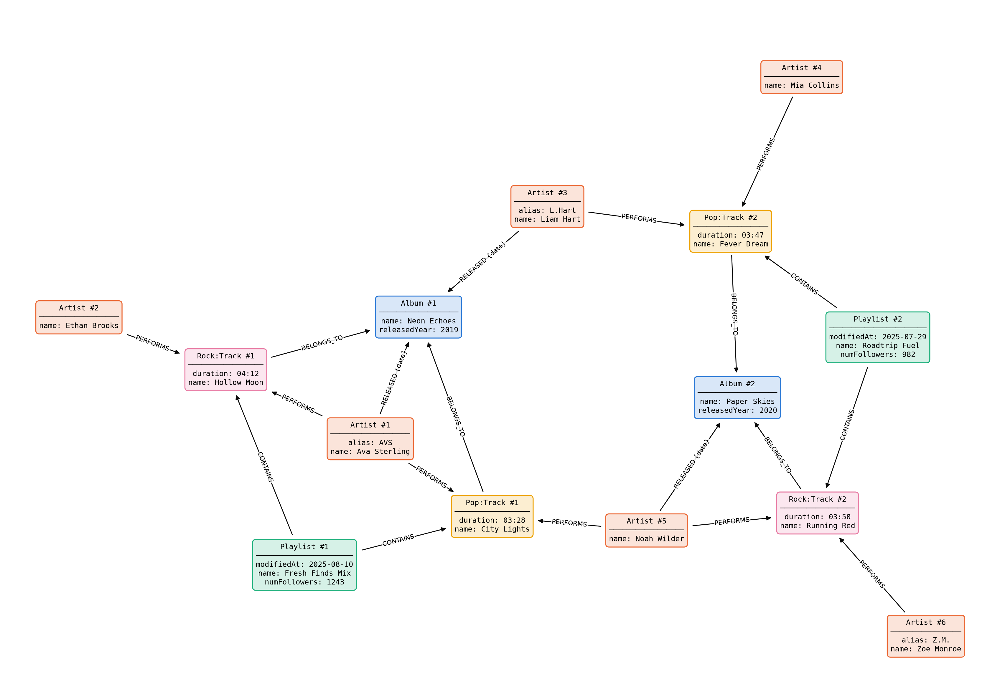

<strong>Node list (click to expand)</strong>
— when the figure is cluttered, this listing is authoritative

| Node id | Labels | Properties |
| --- | --- | --- |
| Album #1 | Album | `name`: Neon Echoes, `releasedYear`: 2019 |
| Album #2 | Album | `name`: Paper Skies, `releasedYear`: 2020 |
| Artist #1 | Artist | `alias`: AVS, `name`: Ava Sterling |
| Artist #2 | Artist | `name`: Ethan Brooks |
| Artist #3 | Artist | `alias`: L.Hart, `name`: Liam Hart |
| Artist #4 | Artist | `name`: Mia Collins |
| Artist #5 | Artist | `name`: Noah Wilder |
| Artist #6 | Artist | `alias`: Z.M., `name`: Zoe Monroe |
| Playlist #1 | Playlist | `modifiedAt`: 2025-08-10, `name`: Fresh Finds Mix, `numFollowers`: 1243 |
| Playlist #2 | Playlist | `modifiedAt`: 2025-07-29, `name`: Roadtrip Fuel, `numFollowers`: 982 |
| Pop:Track #1 | Pop:Track | `duration`: 03:28, `name`: City Lights |
| Pop:Track #2 | Pop:Track | `duration`: 03:47, `name`: Fever Dream |
| Rock:Track #1 | Rock:Track | `duration`: 04:12, `name`: Hollow Moon |
| Rock:Track #2 | Rock:Track | `duration`: 03:50, `name`: Running Red |

<strong>Edge list (click to expand)</strong>
— when the figure is cluttered, this listing is authoritative

| Source | Edge label | Target | Properties |
| --- | --- | --- | --- |
| Pop:Track #1 | BELONGS_TO | Album #1 | — |
| Pop:Track #2 | BELONGS_TO | Album #2 | — |
| Rock:Track #1 | BELONGS_TO | Album #1 | — |
| Rock:Track #2 | BELONGS_TO | Album #2 | — |
| Playlist #1 | CONTAINS | Pop:Track #1 | — |
| Playlist #1 | CONTAINS | Rock:Track #1 | — |
| Playlist #2 | CONTAINS | Pop:Track #2 | — |
| Playlist #2 | CONTAINS | Rock:Track #2 | — |
| Artist #1 | PERFORMS | Pop:Track #1 | — |
| Artist #1 | PERFORMS | Rock:Track #1 | — |
| Artist #2 | PERFORMS | Rock:Track #1 | — |
| Artist #3 | PERFORMS | Pop:Track #2 | — |
| Artist #4 | PERFORMS | Pop:Track #2 | — |
| Artist #5 | PERFORMS | Pop:Track #1 | — |
| Artist #5 | PERFORMS | Rock:Track #2 | — |
| Artist #6 | PERFORMS | Rock:Track #2 | — |
| Artist #1 | RELEASED | Album #1 | `date`: 2019-05-21 |
| Artist #3 | RELEASED | Album #1 | `date`: 2021-09-03 |
| Artist #5 | RELEASED | Album #2 | `date`: 2020-06-12 |

### Candidate schemas

<table>
  <tr>
    <td align="center" valign="top" width="50%">
      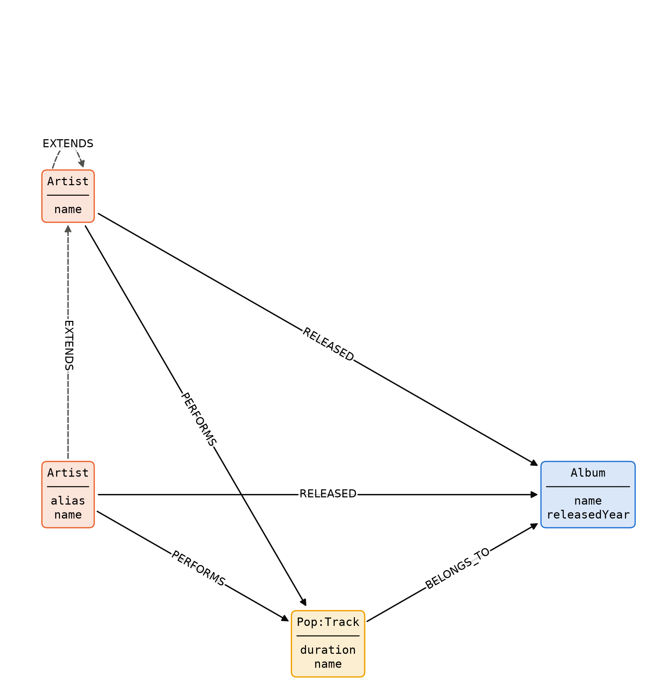 <strong>Candidate A</strong>
    </td>
    <td align="center" valign="top" width="50%">
      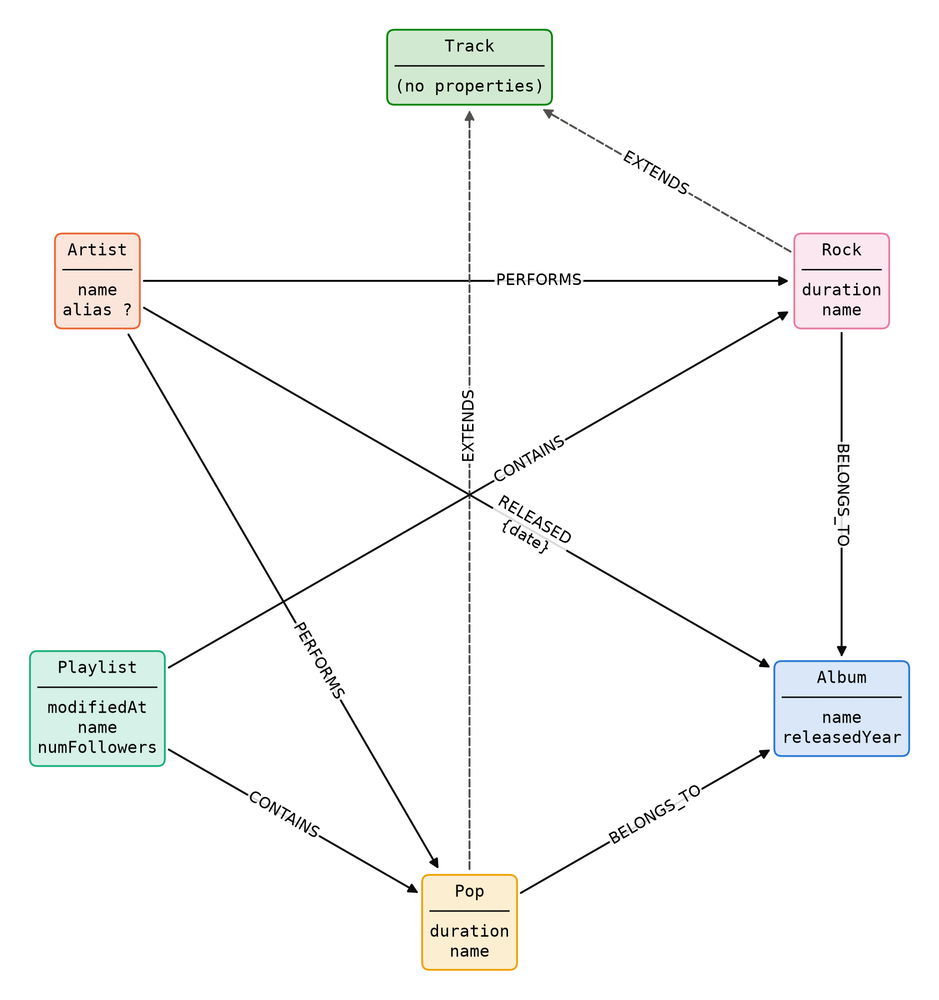 <strong>Candidate B</strong>
    </td>
  </tr>
  <tr>
    <td align="center" valign="top" width="50%">
      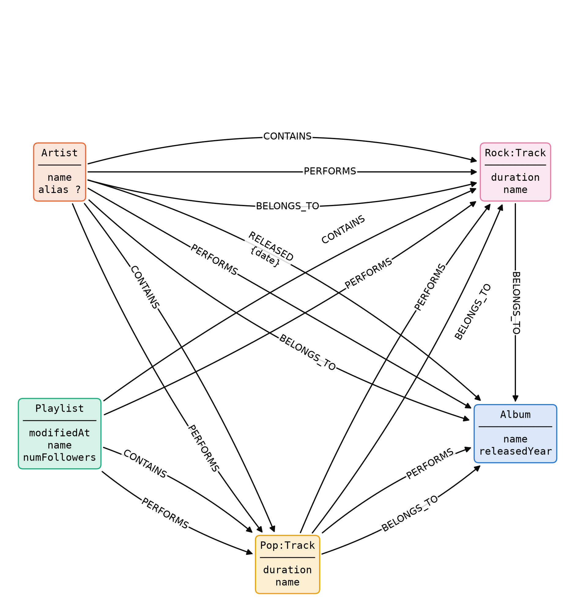 <strong>Candidate C</strong>
    </td>
    <td align="center" valign="top" width="50%">
      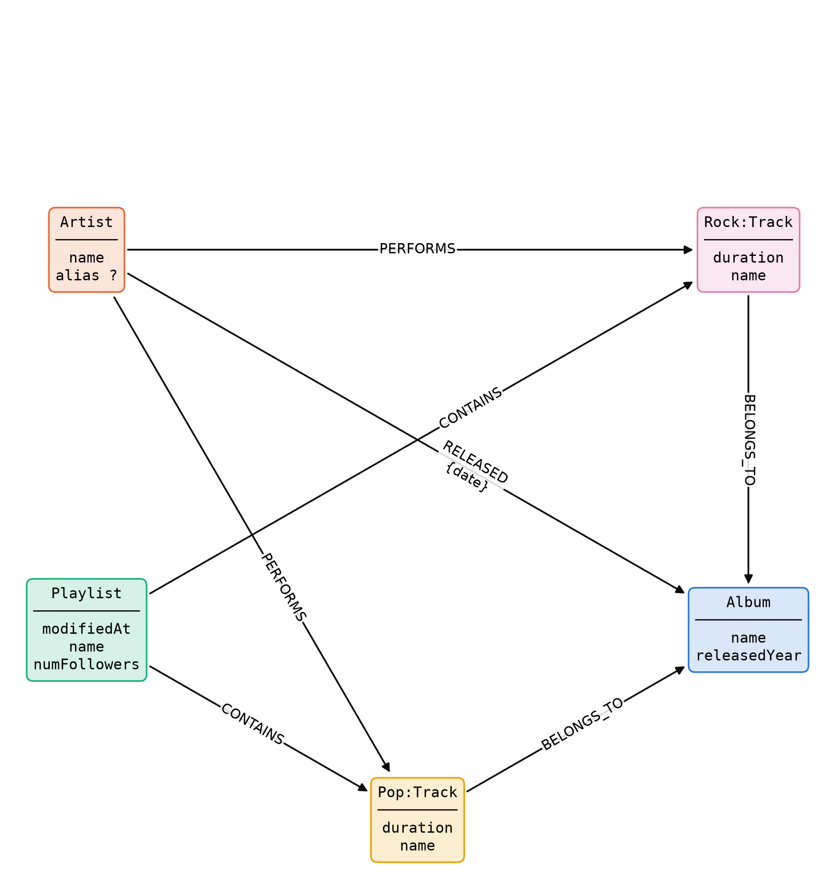 <strong>Candidate D</strong>
    </td>
  </tr>
</table>

*Click a figure to open it at full size.*

#### Candidate schema A

<strong>Type definitions of candidate A (textual, click to expand)</strong>
— when the figure is cluttered, this listing is authoritative

Node types:

- `Album {name, releasedYear}`
- `Artist type 1 {alias, name}`
- `Artist type 2 {name}`
- `Pop:Track {duration, name}`

Edge types (`(source)-[label {properties}]->(target)`):

- `(Pop:Track)-[BELONGS_TO]->(Album)`
- `(Artist type 1)-[EXTENDS]->(Artist type 2)`
- `(Artist type 2)-[EXTENDS]->(Artist type 2)`
- `(Artist type 1)-[PERFORMS]->(Pop:Track)`
- `(Artist type 2)-[PERFORMS]->(Pop:Track)`
- `(Artist type 1)-[RELEASED]->(Album)`
- `(Artist type 2)-[RELEASED]->(Album)`

#### Candidate schema B

<strong>Type definitions of candidate B (textual, click to expand)</strong>
— when the figure is cluttered, this listing is authoritative

Node types:

- `Album {name, releasedYear}`
- `Artist {name, alias?}`
- `Playlist {modifiedAt, name, numFollowers}`
- `Pop {duration, name}`
- `Rock {duration, name}`
- `Track {}`

Edge types (`(source)-[label {properties}]->(target)`):

- `(Pop)-[BELONGS_TO]->(Album)`
- `(Rock)-[BELONGS_TO]->(Album)`
- `(Playlist)-[CONTAINS]->(Pop)`
- `(Playlist)-[CONTAINS]->(Rock)`
- `(Pop)-[EXTENDS]->(Track)`
- `(Rock)-[EXTENDS]->(Track)`
- `(Artist)-[PERFORMS]->(Pop)`
- `(Artist)-[PERFORMS]->(Rock)`
- `(Artist)-[RELEASED {date}]->(Album)`

#### Candidate schema C

<strong>Type definitions of candidate C (textual, click to expand)</strong>
— when the figure is cluttered, this listing is authoritative

Node types:

- `Album {name, releasedYear}`
- `Artist {name, alias?}`
- `Playlist {modifiedAt, name, numFollowers}`
- `Pop:Track {duration, name}`
- `Rock:Track {duration, name}`

Edge types (`(source)-[label {properties}]->(target)`):

- `(Artist)-[BELONGS_TO]->(Album)`
- `(Artist)-[BELONGS_TO]->(Rock:Track)`
- `(Pop:Track)-[BELONGS_TO]->(Album)`
- `(Pop:Track)-[BELONGS_TO]->(Rock:Track)`
- `(Rock:Track)-[BELONGS_TO]->(Album)`
- `(Artist)-[CONTAINS]->(Pop:Track)`
- `(Artist)-[CONTAINS]->(Rock:Track)`
- `(Playlist)-[CONTAINS]->(Pop:Track)`
- `(Playlist)-[CONTAINS]->(Rock:Track)`
- `(Artist)-[PERFORMS]->(Album)`
- `(Artist)-[PERFORMS]->(Pop:Track)`
- `(Artist)-[PERFORMS]->(Rock:Track)`
- `(Playlist)-[PERFORMS]->(Pop:Track)`
- `(Playlist)-[PERFORMS]->(Rock:Track)`
- `(Pop:Track)-[PERFORMS]->(Album)`
- `(Pop:Track)-[PERFORMS]->(Rock:Track)`
- `(Artist)-[RELEASED {date}]->(Album)`

#### Candidate schema D

<strong>Type definitions of candidate D (textual, click to expand)</strong>
— when the figure is cluttered, this listing is authoritative

Node types:

- `Album {name, releasedYear}`
- `Artist {name, alias?}`
- `Playlist {modifiedAt, name, numFollowers}`
- `Pop:Track {duration, name}`
- `Rock:Track {duration, name}`

Edge types (`(source)-[label {properties}]->(target)`):

- `(Pop:Track)-[BELONGS_TO]->(Album)`
- `(Rock:Track)-[BELONGS_TO]->(Album)`
- `(Playlist)-[CONTAINS]->(Pop:Track)`
- `(Playlist)-[CONTAINS]->(Rock:Track)`
- `(Artist)-[PERFORMS]->(Pop:Track)`
- `(Artist)-[PERFORMS]->(Rock:Track)`
- `(Artist)-[RELEASED {date}]->(Album)`

---

## Task 2 (Q5-2): Academic publications

### Data

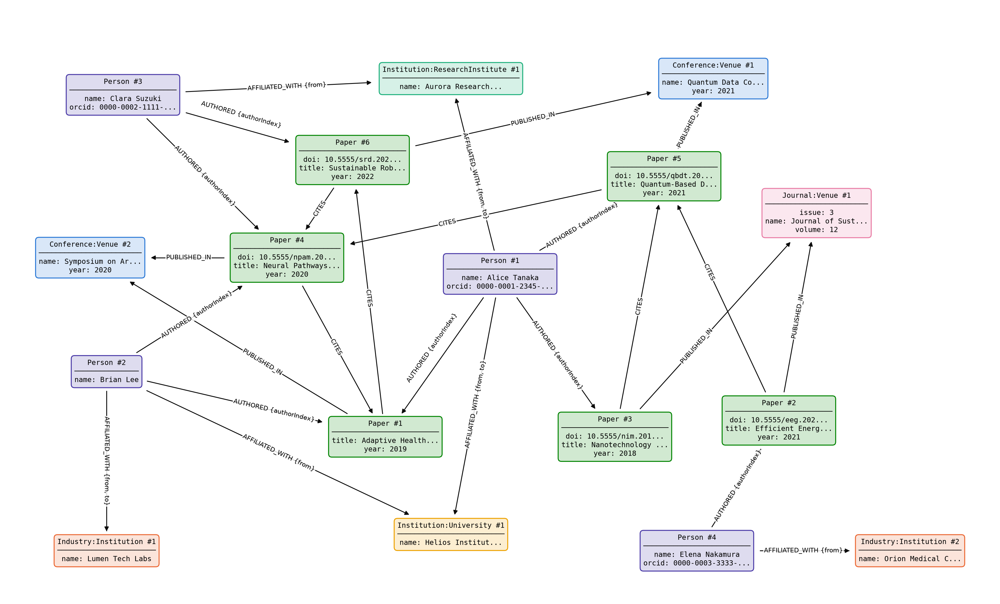

<strong>Node list (click to expand)</strong>

| Node id | Labels | Properties |
| --- | --- | --- |
| Conference:Venue #1 | Conference:Venue | `name`: Quantum Data Communications, `year`: 2021 |
| Conference:Venue #2 | Conference:Venue | `name`: Symposium on Artificial Minds, `year`: 2020 |
| Industry:Institution #1 | Industry:Institution | `name`: Lumen Tech Labs |
| Industry:Institution #2 | Industry:Institution | `name`: Orion Medical Center |
| Institution:ResearchInstitute #1 | Institution:ResearchInstitute | `name`: Aurora Research Institute |
| Institution:University #1 | Institution:University | `name`: Helios Institute of Science |
| Journal:Venue #1 | Journal:Venue | `issue`: 3, `name`: Journal of Sustainable Robotics, `volume`: 12 |
| Paper #1 | Paper | `title`: Adaptive Healthcare Systems, `year`: 2019 |
| Paper #2 | Paper | `doi`: 10.5555/eeg.2021.077, `title`: Efficient Energy Grids, `year`: 2021 |
| Paper #3 | Paper | `doi`: 10.5555/nim.2018.031, `title`: Nanotechnology in Medicine, `year`: 2018 |
| Paper #4 | Paper | `doi`: 10.5555/npam.2020.001, `title`: Neural Pathways in Artificial Minds, `year`: 2020 |
| Paper #5 | Paper | `doi`: 10.5555/qbdt.2021.042, `title`: Quantum-Based Data Transmission, `year`: 2021 |
| Paper #6 | Paper | `doi`: 10.5555/srd.2022.010, `title`: Sustainable Robotics Design, `year`: 2022 |
| Person #1 | Person | `name`: Alice Tanaka, `orcid`: 0000-0001-2345-6789 |
| Person #2 | Person | `name`: Brian Lee |
| Person #3 | Person | `name`: Clara Suzuki, `orcid`: 0000-0002-1111-2222 |
| Person #4 | Person | `name`: Elena Nakamura, `orcid`: 0000-0003-3333-4444 |

<strong>Edge list (click to expand)</strong>

| Source | Edge label | Target | Properties |
| --- | --- | --- | --- |
| Person #1 | AFFILIATED_WITH | Institution:ResearchInstitute #1 | `from`: 2018-04, `to`: 2021-03 |
| Person #1 | AFFILIATED_WITH | Institution:University #1 | `from`: 2016-04, `to`: 2021-09 |
| Person #2 | AFFILIATED_WITH | Industry:Institution #1 | `from`: 2019-06, `to`: 2023-03 |
| Person #2 | AFFILIATED_WITH | Institution:University #1 | `from`: 2019-04 |
| Person #3 | AFFILIATED_WITH | Institution:ResearchInstitute #1 | `from`: 2017-10 |
| Person #4 | AFFILIATED_WITH | Industry:Institution #2 | `from`: 2020-01 |
| Person #1 | AUTHORED | Paper #1 | `authorIndex`: 2 |
| Person #1 | AUTHORED | Paper #3 | `authorIndex`: 1 |
| Person #1 | AUTHORED | Paper #5 | `authorIndex`: 1 |
| Person #2 | AUTHORED | Paper #1 | `authorIndex`: 1 |
| Person #2 | AUTHORED | Paper #4 | `authorIndex`: 1 |
| Person #3 | AUTHORED | Paper #4 | `authorIndex`: 2 |
| Person #3 | AUTHORED | Paper #6 | `authorIndex`: 1 |
| Person #4 | AUTHORED | Paper #2 | `authorIndex`: 1 |
| Paper #1 | CITES | Paper #6 | — |
| Paper #2 | CITES | Paper #5 | — |
| Paper #3 | CITES | Paper #5 | — |
| Paper #4 | CITES | Paper #1 | — |
| Paper #5 | CITES | Paper #4 | — |
| Paper #6 | CITES | Paper #4 | — |
| Paper #1 | PUBLISHED_IN | Conference:Venue #2 | — |
| Paper #2 | PUBLISHED_IN | Journal:Venue #1 | — |
| Paper #3 | PUBLISHED_IN | Journal:Venue #1 | — |
| Paper #4 | PUBLISHED_IN | Conference:Venue #2 | — |
| Paper #5 | PUBLISHED_IN | Conference:Venue #1 | — |
| Paper #6 | PUBLISHED_IN | Conference:Venue #1 | — |

### Candidate schemas

<table>
  <tr>
    <td align="center" valign="top" width="50%">
      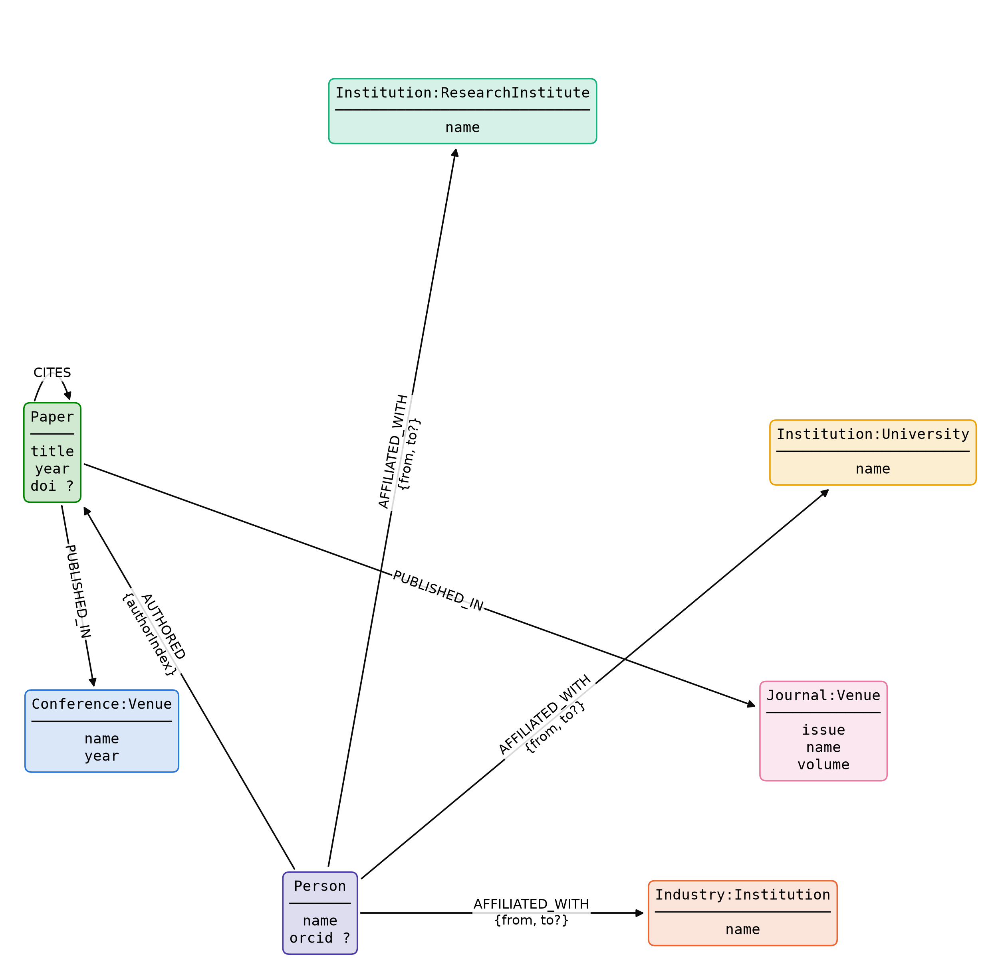 <strong>Candidate A</strong>
    </td>
    <td align="center" valign="top" width="50%">
      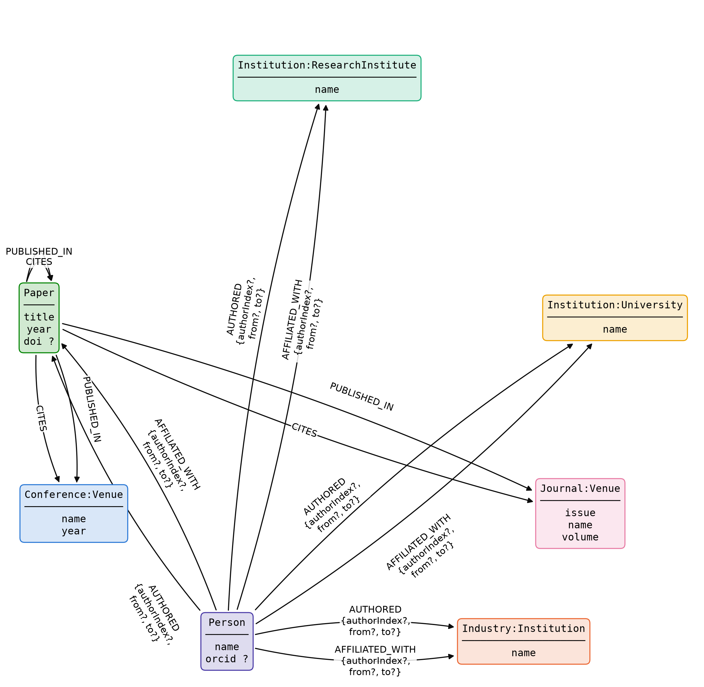 <strong>Candidate B</strong>
    </td>
  </tr>
  <tr>
    <td align="center" valign="top" width="50%">
      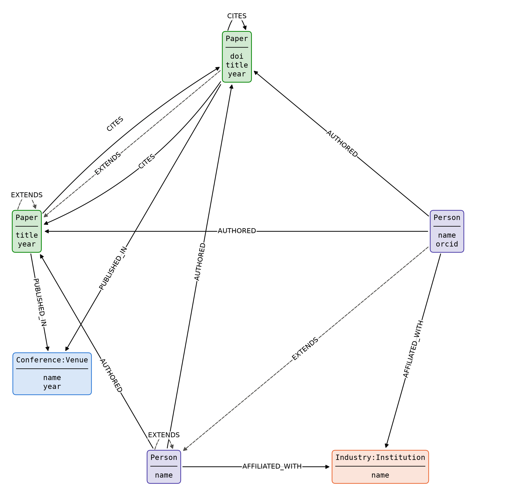 <strong>Candidate C</strong>
    </td>
    <td align="center" valign="top" width="50%">
      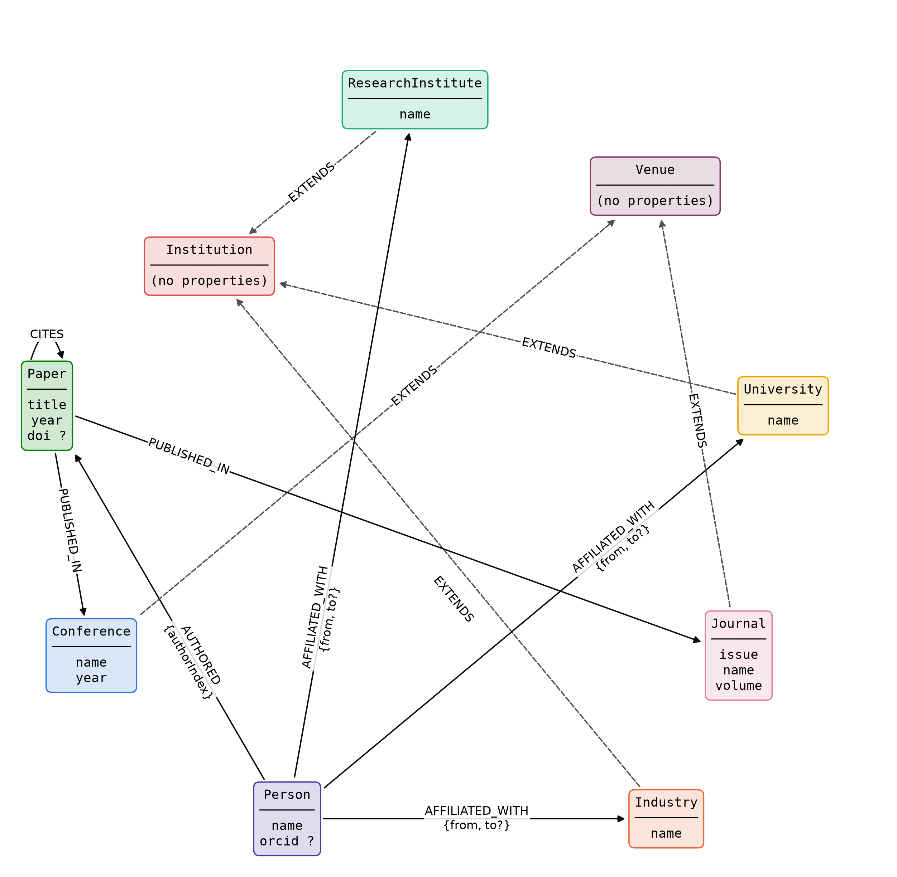 <strong>Candidate D</strong>
    </td>
  </tr>
</table>

*Click a figure to open it at full size.*

#### Candidate schema A

<strong>Type definitions of candidate A (textual, click to expand)</strong>

Node types:

- `Conference:Venue {name, year}`
- `Industry:Institution {name}`
- `Institution:ResearchInstitute {name}`
- `Institution:University {name}`
- `Journal:Venue {issue, name, volume}`
- `Paper {title, year, doi?}`
- `Person {name, orcid?}`

Edge types (`(source)-[label {properties}]->(target)`):

- `(Person)-[AFFILIATED_WITH {from, to?}]->(Industry:Institution)`
- `(Person)-[AFFILIATED_WITH {from, to?}]->(Institution:ResearchInstitute)`
- `(Person)-[AFFILIATED_WITH {from, to?}]->(Institution:University)`
- `(Person)-[AUTHORED {authorIndex}]->(Paper)`
- `(Paper)-[CITES]->(Paper)`
- `(Paper)-[PUBLISHED_IN]->(Conference:Venue)`
- `(Paper)-[PUBLISHED_IN]->(Journal:Venue)`

#### Candidate schema B

<strong>Type definitions of candidate B (textual, click to expand)</strong>

Node types:

- `Conference:Venue {name, year}`
- `Industry:Institution {name}`
- `Institution:ResearchInstitute {name}`
- `Institution:University {name}`
- `Journal:Venue {issue, name, volume}`
- `Paper {title, year, doi?}`
- `Person {name, orcid?}`

Edge types (`(source)-[label {properties}]->(target)`):

- `(Person)-[AFFILIATED_WITH {authorIndex?, from?, to?}]->(Industry:Institution)`
- `(Person)-[AFFILIATED_WITH {authorIndex?, from?, to?}]->(Institution:ResearchInstitute)`
- `(Person)-[AFFILIATED_WITH {authorIndex?, from?, to?}]->(Institution:University)`
- `(Person)-[AFFILIATED_WITH {authorIndex?, from?, to?}]->(Paper)`
- `(Person)-[AUTHORED {authorIndex?, from?, to?}]->(Industry:Institution)`
- `(Person)-[AUTHORED {authorIndex?, from?, to?}]->(Institution:ResearchInstitute)`
- `(Person)-[AUTHORED {authorIndex?, from?, to?}]->(Institution:University)`
- `(Person)-[AUTHORED {authorIndex?, from?, to?}]->(Paper)`
- `(Paper)-[CITES]->(Conference:Venue)`
- `(Paper)-[CITES]->(Journal:Venue)`
- `(Paper)-[CITES]->(Paper)`
- `(Paper)-[PUBLISHED_IN]->(Conference:Venue)`
- `(Paper)-[PUBLISHED_IN]->(Journal:Venue)`
- `(Paper)-[PUBLISHED_IN]->(Paper)`

#### Candidate schema C

<strong>Type definitions of candidate C (textual, click to expand)</strong>

Node types:

- `Conference:Venue {name, year}`
- `Industry:Institution {name}`
- `Paper type 1 {doi, title, year}`
- `Paper type 2 {title, year}`
- `Person type 1 {name}`
- `Person type 2 {name, orcid}`

Edge types (`(source)-[label {properties}]->(target)`):

- `(Person type 1)-[AFFILIATED_WITH]->(Industry:Institution)`
- `(Person type 2)-[AFFILIATED_WITH]->(Industry:Institution)`
- `(Person type 1)-[AUTHORED]->(Paper type 1)`
- `(Person type 1)-[AUTHORED]->(Paper type 2)`
- `(Person type 2)-[AUTHORED]->(Paper type 1)`
- `(Person type 2)-[AUTHORED]->(Paper type 2)`
- `(Paper type 1)-[CITES]->(Paper type 1)`
- `(Paper type 1)-[CITES]->(Paper type 2)`
- `(Paper type 2)-[CITES]->(Paper type 1)`
- `(Paper type 1)-[EXTENDS]->(Paper type 2)`
- `(Paper type 2)-[EXTENDS]->(Paper type 2)`
- `(Person type 1)-[EXTENDS]->(Person type 1)`
- `(Person type 2)-[EXTENDS]->(Person type 1)`
- `(Paper type 1)-[PUBLISHED_IN]->(Conference:Venue)`
- `(Paper type 2)-[PUBLISHED_IN]->(Conference:Venue)`

#### Candidate schema D

<strong>Type definitions of candidate D (textual, click to expand)</strong>

Node types:

- `Conference {name, year}`
- `Industry {name}`
- `Institution {}`
- `Journal {issue, name, volume}`
- `Paper {title, year, doi?}`
- `Person {name, orcid?}`
- `ResearchInstitute {name}`
- `University {name}`
- `Venue {}`

Edge types (`(source)-[label {properties}]->(target)`):

- `(Person)-[AFFILIATED_WITH {from, to?}]->(Industry)`
- `(Person)-[AFFILIATED_WITH {from, to?}]->(ResearchInstitute)`
- `(Person)-[AFFILIATED_WITH {from, to?}]->(University)`
- `(Person)-[AUTHORED {authorIndex}]->(Paper)`
- `(Paper)-[CITES]->(Paper)`
- `(Conference)-[EXTENDS]->(Venue)`
- `(Industry)-[EXTENDS]->(Institution)`
- `(Journal)-[EXTENDS]->(Venue)`
- `(ResearchInstitute)-[EXTENDS]->(Institution)`
- `(University)-[EXTENDS]->(Institution)`
- `(Paper)-[PUBLISHED_IN]->(Conference)`
- `(Paper)-[PUBLISHED_IN]->(Journal)`

---

## Task 3 (Q5-3): E-commerce

### Data

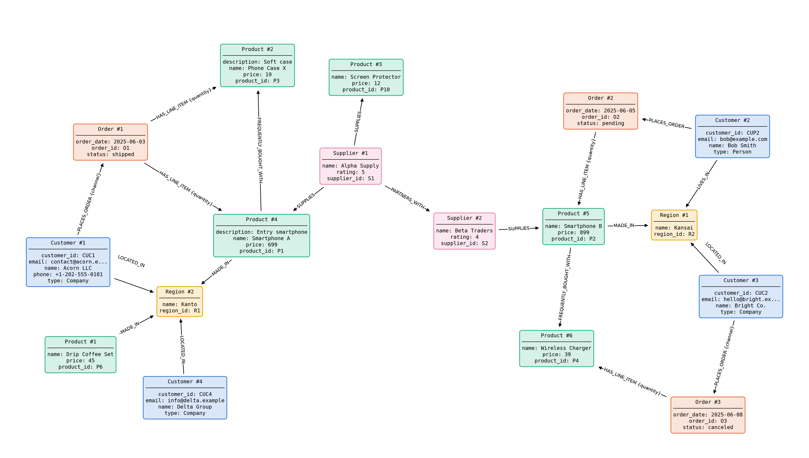

<strong>Node list (click to expand)</strong>

| Node id | Labels | Properties |
| --- | --- | --- |
| Customer #1 | Customer | `customer_id`: CUC1, `email`: contact@acorn.example, `name`: Acorn LLC, `phone`: +1-202-555-0101, `type`: Company |
| Customer #2 | Customer | `customer_id`: CUP2, `email`: bob@example.com, `name`: Bob Smith, `type`: Person |
| Customer #3 | Customer | `customer_id`: CUC2, `email`: hello@bright.example, `name`: Bright Co., `type`: Company |
| Customer #4 | Customer | `customer_id`: CUC4, `email`: info@delta.example, `name`: Delta Group, `type`: Company |
| Order #1 | Order | `order_date`: 2025-06-03, `order_id`: O1, `status`: shipped |
| Order #2 | Order | `order_date`: 2025-06-05, `order_id`: O2, `status`: pending |
| Order #3 | Order | `order_date`: 2025-06-08, `order_id`: O3, `status`: canceled |
| Product #1 | Product | `name`: Drip Coffee Set, `price`: 45, `product_id`: P6 |
| Product #2 | Product | `description`: Soft case, `name`: Phone Case X, `price`: 19, `product_id`: P3 |
| Product #3 | Product | `name`: Screen Protector, `price`: 12, `product_id`: P10 |
| Product #4 | Product | `description`: Entry smartphone, `name`: Smartphone A, `price`: 699, `product_id`: P1 |
| Product #5 | Product | `name`: Smartphone B, `price`: 899, `product_id`: P2 |
| Product #6 | Product | `name`: Wireless Charger, `price`: 39, `product_id`: P4 |
| Region #1 | Region | `name`: Kansai, `region_id`: R2 |
| Region #2 | Region | `name`: Kanto, `region_id`: R1 |
| Supplier #1 | Supplier | `name`: Alpha Supply, `rating`: 5, `supplier_id`: S1 |
| Supplier #2 | Supplier | `name`: Beta Traders, `rating`: 4, `supplier_id`: S2 |

<strong>Edge list (click to expand)</strong>

| Source | Edge label | Target | Properties |
| --- | --- | --- | --- |
| Product #4 | FREQUENTLY_BOUGHT_WITH | Product #2 | — |
| Product #5 | FREQUENTLY_BOUGHT_WITH | Product #6 | — |
| Order #1 | HAS_LINE_ITEM | Product #2 | `quantity`: 2 |
| Order #1 | HAS_LINE_ITEM | Product #4 | `quantity`: 1 |
| Order #2 | HAS_LINE_ITEM | Product #5 | `quantity`: 1 |
| Order #3 | HAS_LINE_ITEM | Product #6 | `quantity`: 1 |
| Customer #2 | LIVES_IN | Region #1 | — |
| Customer #1 | LOCATED_IN | Region #2 | — |
| Customer #3 | LOCATED_IN | Region #1 | — |
| Customer #4 | LOCATED_IN | Region #2 | — |
| Product #1 | MADE_IN | Region #2 | — |
| Product #4 | MADE_IN | Region #2 | — |
| Product #5 | MADE_IN | Region #1 | — |
| Supplier #1 | PARTNERS_WITH | Supplier #2 | — |
| Customer #1 | PLACES_ORDER | Order #1 | `channel`: web |
| Customer #2 | PLACES_ORDER | Order #2 | — |
| Customer #3 | PLACES_ORDER | Order #3 | `channel`: phone |
| Supplier #1 | SUPPLIES | Product #3 | — |
| Supplier #1 | SUPPLIES | Product #4 | — |
| Supplier #2 | SUPPLIES | Product #5 | — |

### Candidate schemas

<table>
  <tr>
    <td align="center" valign="top" width="50%">
      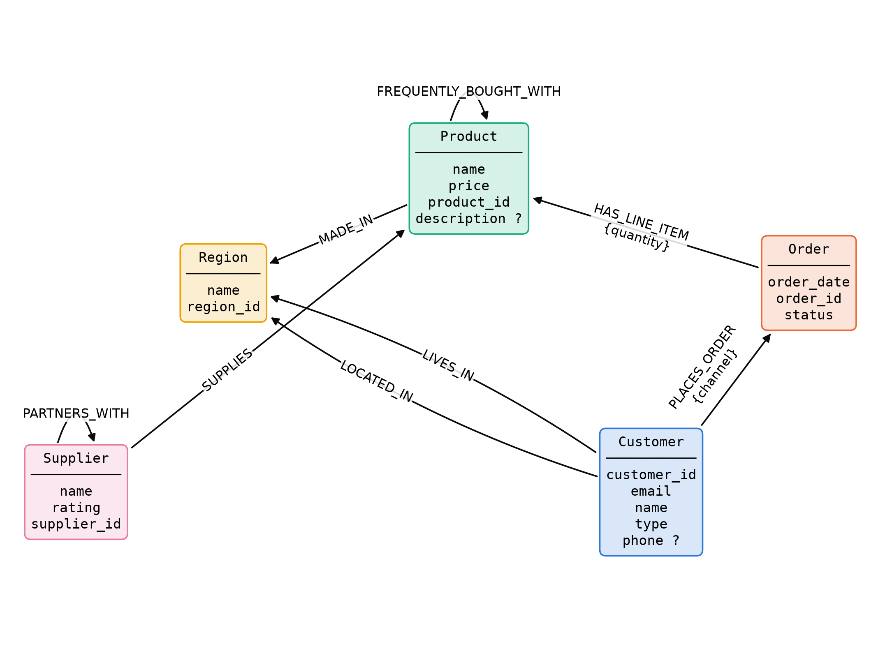 <strong>Candidate A</strong>
    </td>
    <td align="center" valign="top" width="50%">
       <strong>Candidate B</strong>
    </td>
  </tr>
  <tr>
    <td align="center" valign="top" width="50%">
      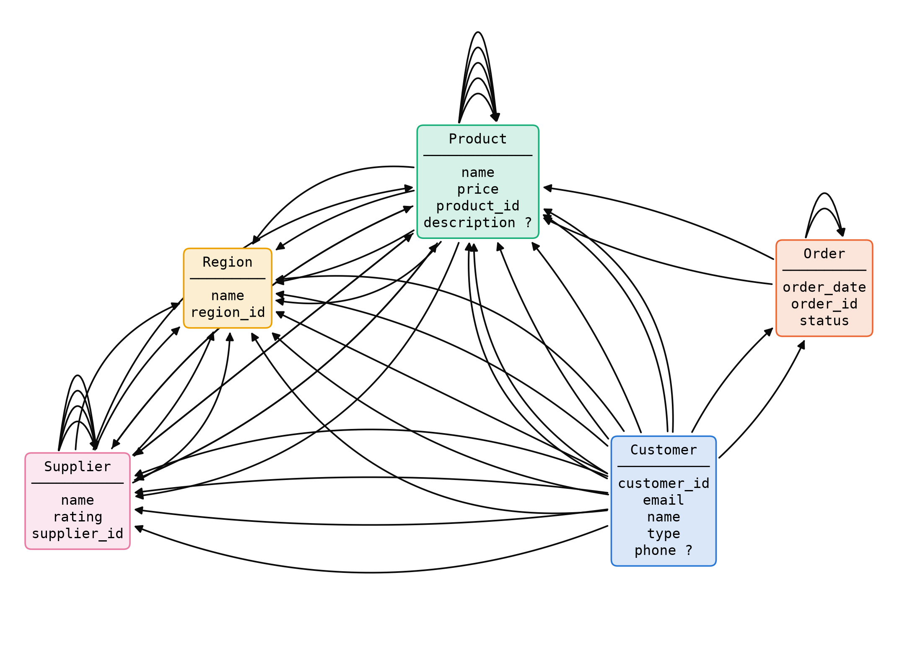 <strong>Candidate C</strong>
    </td>
    <td align="center" valign="top" width="50%">
      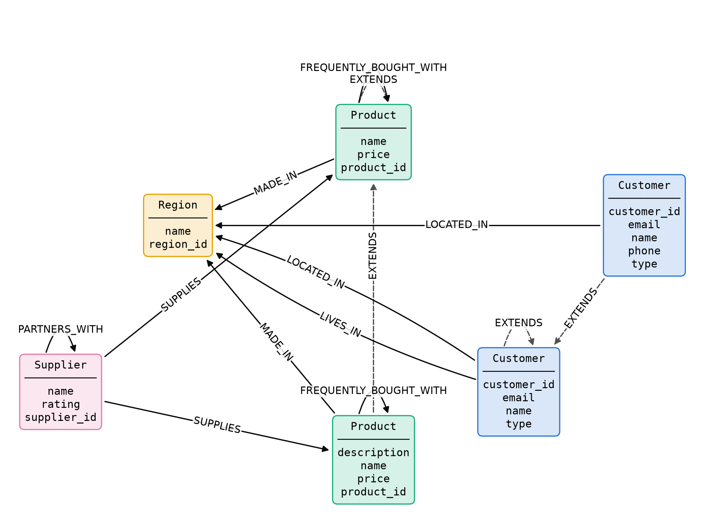 <strong>Candidate D</strong>
    </td>
  </tr>
</table>

*Click a figure to open it at full size.*

Note: **candidates A and B look almost identical.** Their only difference is how the `PLACES_ORDER` edge type treats its `channel` property: it is **mandatory in A (`{channel}`) and optional in B (`{channel?}`)**. All other node types and edge types are identical (the drawing positions of `LIVES_IN` and `LOCATED_IN` are swapped between the two figures, but both are `(Customer)-[...]->(Region)` and their content is the same).

#### Candidate schema A

<strong>Type definitions of candidate A (textual, click to expand)</strong>

Node types:

- `Customer {customer_id, email, name, type, phone?}`
- `Order {order_date, order_id, status}`
- `Product {name, price, product_id, description?}`
- `Region {name, region_id}`
- `Supplier {name, rating, supplier_id}`

Edge types (`(source)-[label {properties}]->(target)`):

- `(Product)-[FREQUENTLY_BOUGHT_WITH]->(Product)`
- `(Order)-[HAS_LINE_ITEM {quantity}]->(Product)`
- `(Customer)-[LIVES_IN]->(Region)`
- `(Customer)-[LOCATED_IN]->(Region)`
- `(Product)-[MADE_IN]->(Region)`
- `(Supplier)-[PARTNERS_WITH]->(Supplier)`
- `(Customer)-[PLACES_ORDER {channel}]->(Order)`
- `(Supplier)-[SUPPLIES]->(Product)`

#### Candidate schema B

<strong>Type definitions of candidate B (textual, click to expand)</strong>

Node types:

- `Customer {customer_id, email, name, type, phone?}`
- `Order {order_date, order_id, status}`
- `Product {name, price, product_id, description?}`
- `Region {name, region_id}`
- `Supplier {name, rating, supplier_id}`

Edge types (`(source)-[label {properties}]->(target)`):

- `(Product)-[FREQUENTLY_BOUGHT_WITH]->(Product)`
- `(Order)-[HAS_LINE_ITEM {quantity}]->(Product)`
- `(Customer)-[LIVES_IN]->(Region)`
- `(Customer)-[LOCATED_IN]->(Region)`
- `(Product)-[MADE_IN]->(Region)`
- `(Supplier)-[PARTNERS_WITH]->(Supplier)`
- `(Customer)-[PLACES_ORDER {channel?}]->(Order)`
- `(Supplier)-[SUPPLIES]->(Product)`

#### Candidate schema C

Note: this candidate has too many edge types, so **edge labels are omitted from the figure**. The textual type listing below gives them in full.

<strong>Type definitions of candidate C (textual, click to expand)</strong>

Node types:

- `Customer {customer_id, email, name, type, phone?}`
- `Order {order_date, order_id, status}`
- `Product {name, price, product_id, description?}`
- `Region {name, region_id}`
- `Supplier {name, rating, supplier_id}`

Edge types (`(source)-[label {properties}]->(target)`):

- `(Product)-[FREQUENTLY_BOUGHT_WITH]->(Product)`
- `(Customer)-[HAS_LINE_ITEM {channel?, quantity?}]->(Order)`
- `(Customer)-[HAS_LINE_ITEM {channel?, quantity?}]->(Product)`
- `(Order)-[HAS_LINE_ITEM {channel?, quantity?}]->(Order)`
- `(Order)-[HAS_LINE_ITEM {channel?, quantity?}]->(Product)`
- `(Customer)-[LIVES_IN]->(Region)`
- `(Customer)-[LOCATED_IN]->(Product)`
- `(Customer)-[LOCATED_IN]->(Region)`
- `(Customer)-[LOCATED_IN]->(Supplier)`
- `(Product)-[LOCATED_IN]->(Product)`
- `(Product)-[LOCATED_IN]->(Region)`
- `(Product)-[LOCATED_IN]->(Supplier)`
- `(Supplier)-[LOCATED_IN]->(Product)`
- `(Supplier)-[LOCATED_IN]->(Region)`
- `(Supplier)-[LOCATED_IN]->(Supplier)`
- `(Customer)-[MADE_IN]->(Product)`
- `(Customer)-[MADE_IN]->(Region)`
- `(Customer)-[MADE_IN]->(Supplier)`
- `(Product)-[MADE_IN]->(Product)`
- `(Product)-[MADE_IN]->(Region)`
- `(Product)-[MADE_IN]->(Supplier)`
- `(Supplier)-[MADE_IN]->(Product)`
- `(Supplier)-[MADE_IN]->(Region)`
- `(Supplier)-[MADE_IN]->(Supplier)`
- `(Customer)-[PARTNERS_WITH]->(Product)`
- `(Customer)-[PARTNERS_WITH]->(Region)`
- `(Customer)-[PARTNERS_WITH]->(Supplier)`
- `(Product)-[PARTNERS_WITH]->(Product)`
- `(Product)-[PARTNERS_WITH]->(Region)`
- `(Product)-[PARTNERS_WITH]->(Supplier)`
- `(Supplier)-[PARTNERS_WITH]->(Product)`
- `(Supplier)-[PARTNERS_WITH]->(Region)`
- `(Supplier)-[PARTNERS_WITH]->(Supplier)`
- `(Customer)-[PLACES_ORDER {channel?, quantity?}]->(Order)`
- `(Customer)-[PLACES_ORDER {channel?, quantity?}]->(Product)`
- `(Order)-[PLACES_ORDER {channel?, quantity?}]->(Order)`
- `(Order)-[PLACES_ORDER {channel?, quantity?}]->(Product)`
- `(Customer)-[SUPPLIES]->(Product)`
- `(Customer)-[SUPPLIES]->(Region)`
- `(Customer)-[SUPPLIES]->(Supplier)`
- `(Product)-[SUPPLIES]->(Product)`
- `(Product)-[SUPPLIES]->(Region)`
- `(Product)-[SUPPLIES]->(Supplier)`
- `(Supplier)-[SUPPLIES]->(Product)`
- `(Supplier)-[SUPPLIES]->(Region)`
- `(Supplier)-[SUPPLIES]->(Supplier)`

#### Candidate schema D

<strong>Type definitions of candidate D (textual, click to expand)</strong>

Node types:

- `Customer type 1 {customer_id, email, name, phone, type}`
- `Customer type 2 {customer_id, email, name, type}`
- `Product type 1 {description, name, price, product_id}`
- `Product type 2 {name, price, product_id}`
- `Region {name, region_id}`
- `Supplier {name, rating, supplier_id}`

Edge types (`(source)-[label {properties}]->(target)`):

- `(Customer type 1)-[EXTENDS]->(Customer type 2)`
- `(Customer type 2)-[EXTENDS]->(Customer type 2)`
- `(Product type 1)-[EXTENDS]->(Product type 2)`
- `(Product type 2)-[EXTENDS]->(Product type 2)`
- `(Product type 1)-[FREQUENTLY_BOUGHT_WITH]->(Product type 1)`
- `(Product type 2)-[FREQUENTLY_BOUGHT_WITH]->(Product type 2)`
- `(Customer type 2)-[LIVES_IN]->(Region)`
- `(Customer type 1)-[LOCATED_IN]->(Region)`
- `(Customer type 2)-[LOCATED_IN]->(Region)`
- `(Product type 1)-[MADE_IN]->(Region)`
- `(Product type 2)-[MADE_IN]->(Region)`
- `(Supplier)-[PARTNERS_WITH]->(Supplier)`
- `(Supplier)-[SUPPLIES]->(Product type 1)`
- `(Supplier)-[SUPPLIES]->(Product type 2)`

---

## Thank you

That is the last question. Please submit your answers via the Google Form.

Thank you very much for taking the time to go through all of this.
Your answers are used only to check how well our schema quality measure agrees
with human judgement.

---
