# ユーザスタディの説明

## 目次
- [1. プロパティグラフとは](#1-プロパティグラフとは)
- [2. スキーマ（Schema）とは](#2-スキーマschemaとは)
- [3. タスクの説明](#3-タスクの説明)
- [4. 実験データベースへの参加](#4-実験データベースへの参加)
- [5. Neo4jの基本操作](#5-neo4jの基本操作)
- [6. 評価の例](#6-評価の例)
- [7. Tips](#7-Tips)
---

## 1. プロパティグラフとは
私たちの身の回りの情報は、人と人のつながり、ユーザと投稿、商品と購入者など、**「もの同士の関係」** で成り立っています。
しかし、従来の リレーショナルデータベース（RDB） では、これらを「行と列の表（テーブル）」として扱うため、複雑な関係を表すには多くの表をつなぐ結合（`JOIN`）操作が必要になります。

たとえば、「Aさんをフォローしている人から“いいね”された投稿」を調べたいとします。この場合、

- 「ユーザ」テーブル
- 「フォロー関係」テーブル
- 「投稿」テーブル
- 「いいね」テーブル

といった複数の表を結合して検索する必要があります。
その結果、SQL文は複雑になり、パフォーマンスも低下しがちです。

こうした複雑な関係を自然に表現できるのが、グラフデータモデル です。グラフモデルでは、データを **ノード（頂点）** と **エッジ（辺）** で表し、「誰が」「どの投稿に」「どんな関係で」つながっているかを図として表現できます。
たとえば「Aさん ←(フォロー)- Bさん -(いいね)→ 投稿X」というように、関係性を直感的に捉えやすくなります。

その中でも特に柔軟で表現力が高いのが **プロパティグラフ（Property Graph）** です。
プロパティグラフでは、ノードとエッジの両方に **ラベル（大まかな種類を表す属性情報）** や **プロパティ（より詳細な属性情報）** を持たせることができます。たとえば、ノードが人であることを表す`Person`ラベルを付与したり、「いいね」を表すエッジに「いついいねしたか」を示す`timestamp`プロパティを追加したりできます。

図1にプロパティグラフの例を示します。このプロパティグラフは、ユーザ同士のフォロー関係や投稿の作成関係を表現しています。
このように、プロパティグラフは複雑な関係性を直感的に表現できるため、ソーシャルネットワーク分析、推薦システム、知識グラフなど、様々な分野で活用されています。以降では、図1を例に、プロパティグラフの各要素について説明します。

<figure>
  <div align="center">
    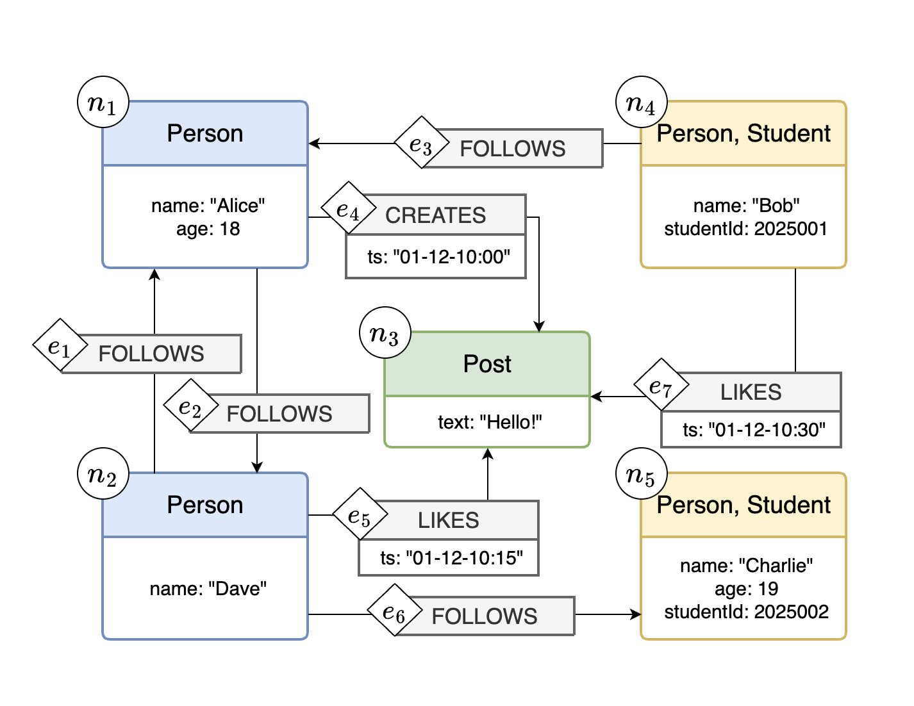
    <p><strong>図1：プロパティグラフの例</strong></p>
  </div>
</figure>

### (1) ノード
図1の $n_1, n_2, \cdots , n_5$がノードに該当します。
ノードは、人、場所、モノ、概念など、様々な実体を表現するために使用されます。

### (2) エッジ
図1の $e_1, e_2, \cdots, e_7$がエッジに該当します。
エッジはノード間の関係性を示します。今回のプロパティグラフではエッジは方向を持ち、始点ノードから終点ノードへ向かう矢印で表現されます。

### (3) ラベル
図1の`Person`や`Student`がノードのラベル、`FOLLOWS`や`CREATES`がエッジのラベルに該当します。
ラベルはノードやエッジの大まかな属性を示すために使用されます。
1つのノードやエッジは、0個以上のラベルを持つことができます。

### (4) プロパティ
図1のノード $n_1$の`name: "Alice"`や`age: 18`、エッジ $e_4$の`ts: 01-12-10:00`などがプロパティに該当します。
また`name`や`age`をプロパティの **キー** 、`"Alice"`や`18`を **値**と呼びます。
プロパティはノードやエッジに付随する詳細な情報を格納するための属性です。
1つのノードやエッジは、0個以上のプロパティを持つことができます。


---

## 2. スキーマ（Schema）とは

プロパティグラフでは、データをノードとエッジで表現し、それぞれにラベルやプロパティを持たせられます。
しかし、<u>データの種類が増えていくと、「どんなノードやエッジが存在するのか」「それぞれにどんなラベルやプロパティを持たせるべきか」を整理しておかないと、データの構造がバラバラになってしまいます。</u>またその結果としてデータの整合性が失われたり、クエリのパフォーマンスが低下したりする恐れがあります。

そこで登場するのが **スキーマ（Schema）** です。スキーマは、グラフデータの設計図やルールブックのようなものです。スキーマを用いて、どんな種類のノードやエッジがあり、それぞれにどんな情報を持たせられるのかを、あらかじめ定義することで、データの一貫性と整合性を保つことができます。

例えばSNSの例を考えてみましょう。

- ユーザは（`Person`）というラベルを持つノードで表現し、そのノードには「名前（`name`）」「年齢（`age`）」などのプロパティがある
- 投稿は（`Post`）というラベルを持つノードで表現し、そのノードには「内容（`text`）」がある
- 「いいね（`LIKES`）」というエッジは「ユーザ」と「投稿」を結び、そのエッジには「いいねした日時（`timestamp`）」がある

このように、<u>スキーマを定義しておくことで「どの種類のノードがどの種類のノードとつながるのか」「どのプロパティが必須なのか」が明確になります。結果としてデータ構造の一貫性が保たれ、クエリの最適化やデータの検証が容易になります。</u>

さらに、スキーマには **「型の継承関係」** を定義することもできます。例えば、「ユーザ」型を基に「学生ユーザ」や「企業アカウント」といった型を派生させることで、スキーマで定義した共通部分を再利用しながらモデルを整理・拡張できます。これにより、複雑なデータモデルを簡潔に、かつ柔軟に表現できるようになります。

図2にスキーマの例を示します。このスキーマは、図1のプロパティグラフに対応しています。
スキーマはノード型とエッジ型で構成されており、ノード型とエッジ型にはそれぞれラベル制約、プロパティ制約、端点制約（エッジ型のみ）などの情報が含まれます。以降は図2のスキーマを例に、スキーマの各要素について説明します。


<div style="display: flex; justify-content: space-around; align-items: flex-start;">
  <figure style="margin: 0 10px;">
    <div align="center">
      
      <p><strong>図2：スキーマの例</strong></p>
    </div>
  </figure>
  <figure style="margin: 0 10px;">
    <div align="center">
      
      <p><strong>（再掲）図1：プロパティグラフの例</strong></p>
    </div>
  </figure>
  
</div>

### (1) ノード型

ノード型には以下の情報が含まれます：
- **ラベル制約**
  - 必須ラベル
  - 任意ラベル（今回のユーザスタディでは使用しないため以降は省略）
- **プロパティ制約**
  - 必須プロパティ
  - 任意プロパティ：図中ではプロパティ名の後に`?`を付与して表現

例えば、図2のノード型 $nt_1$は、以下のような制約を持ちます：
- 必須ラベル：`Person`が必ず存在する
- 必須プロパティ：`name`というプロパティが必ず存在する
- 任意プロパティ：`age`というプロパティが存在しても良い（`?`が付与されているため）

図1のノード $n_1$および $n_2$は図2のノード型 $nt_1$の制約に従っています。

### (2) エッジ型
エッジ型には以下の情報が含まれます：
- **ラベル制約**
  - 必須ラベル
  - 任意ラベル（今回のユーザスタディでは使用しないため以降は省略）
- **プロパティ制約**
  - 必須プロパティ
  - 任意プロパティ
- **端点制約**：エッジがどの種類のノード同士を結ぶかを定めるルールです。エッジはノード同士の関係を表しますが、どんなノードでも自由に結べるわけではありません。そこで「端点制約」により **始点ノード型** と **終点ノード型** を指定します。具体的には以下の2点を定義します：
  - 始点ノード型：どんなタイプのノードをエッジの始点にできるか
  - 終点ノード型：どんなタイプのノードをエッジの終点にできるか

例えば、図2のエッジ型 $et_2$は、以下のような制約を持ちます：
- 必須ラベル：`CREATES`が必ず存在する
- 必須プロパティ：`ts`
- 任意プロパティ：なし
- 端点制約：
  - 始点ノード型が $nt_1$
  - 終点ノード型が $nt_3$
図1のエッジ $e_4$はエッジ型 $et_2$の制約に従っています。


### (3) ノード型の継承
ノード型の **継承** は、あるノード型が別のノード型の属性や制約を引き継ぐことを指します。例えば `Person`というラベルを持つノード型を基礎にして、`Student`や`Teacher`という派生ノード型を作成することができます。

継承関係は、`EXTENDS`という特別なエッジを用いて表現されます。
ノード型の継承を用いることで、共通の属性や制約を再利用し、データモデルをより簡潔に表現できます。
ここで、`EXTENDS`エッジの始点ノード型を**子ノード型**、終点ノード型を**親ノード型**と呼びます。

ノード型の継承を行うと、以下のルールが適用されます：
- ルール1. 子ノード型は親ノード型のラベル制約とプロパティ制約をすべて引き継ぐ
- ルール2. 親ノード型を始点または終点に持つエッジ型の端点制約を、子ノード型にも拡張する

#### 具体例
ここで、小さな具体例を示します。
図3は、図2から一部のノード型とエッジ型、および継承関係を抜き出した部分グラフです。

<div style="display: flex; justify-content: space-around; align-items: flex-start;">
  <figure style="margin: 0 10px;">
    <div align="center">
      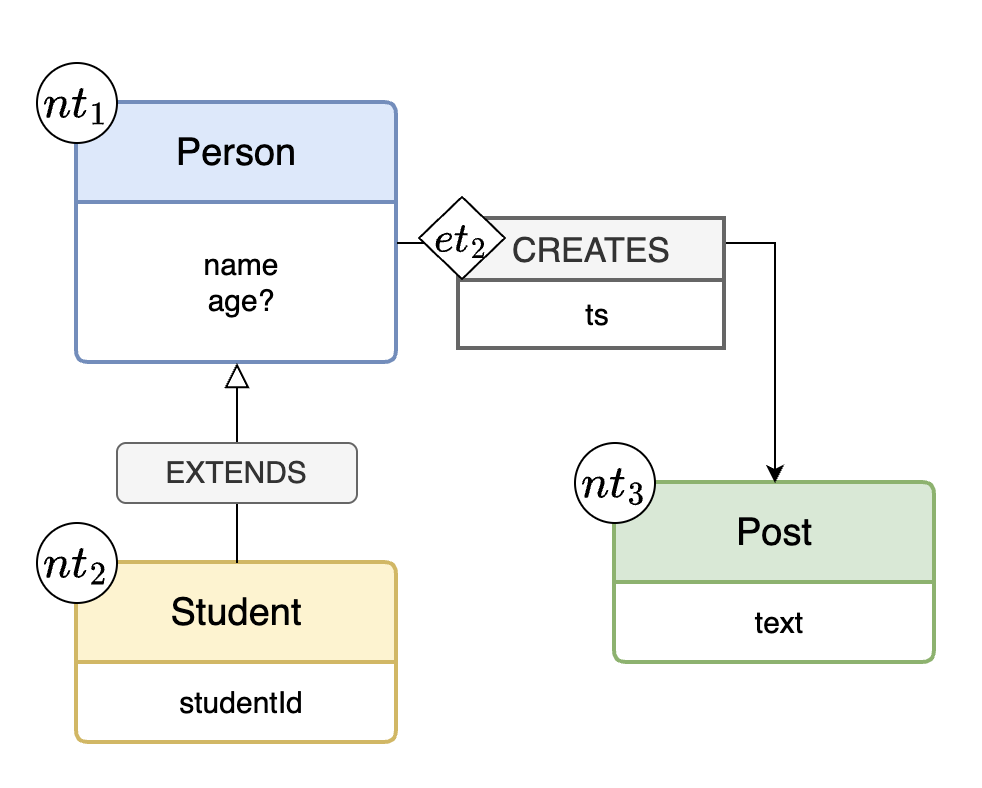
      <p><strong>図3：図2のスキーマの部分グラフ</strong></p>
    </div>
  </figure>
  
  <figure style="margin: 0 10px;">
    <div align="center">
      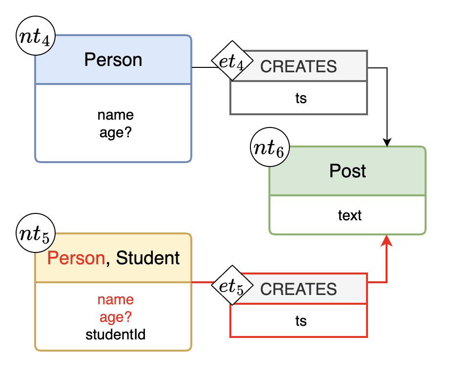
      <p><strong>図4：図3の継承関係を展開したスキーマ</strong></p>
    </div>
  </figure>
</div>

図3の子ノード型 $nt_2$は親ノード型 $nt_1$を継承しています。
したがって、ルール1に従い、子（ $nt_2$）は、親（ $nt_1$）が持つ以下の制約を引き継ぎます：
- 必須ラベル：`Person`が必ず存在する
- 必須プロパティ：`name`が必ず存在する
- 任意プロパティ：`age`が存在しても良い

さらに、ルール2に従い、図3の親（ $nt_1$）を始点とするエッジ型の端点制約が、子（ $nt_2$）にも拡張されます。例えばエッジ型 $et_2$の始点ノード型は $nt_1$ですが、その子である $nt_2$もこのエッジ型の始点ノード型として使用できるようになります。

継承関係を具体的なスキーマ構造に置き換える操作を **展開** と呼びます。図3の継承関係を展開すると図4のようになります。
`EXTENDS`エッジは不要になるため削除され、子ノード型が親ノード型の制約を引き継いだ形になります。
例えば、図4のノード型 $nt_5$には、元々保有していた`Student`という必須ラベルに加えて、継承元のノード型 $nt_1$のラベルやプロパティが追加されています。

図3のスキーマと図4のスキーマは全く同じ意味を持ちますが、図4の方が冗長になります。また図4のスキーマは継承関係を展開しているため、ノード型やエッジ型の追加・変更があった場合にメンテナンスが大変になります。
例えば、図4のスキーマでノード型 $nt_4$に新たな必須プロパティ `email`を追加した場合、ノード型 $nt_5$にも同じ必須プロパティを追加する必要があります。しかし、図2のスキーマであればノード型 $nt_1$に`email`を追加するだけで済みます。

このように、ノード型の継承を使用することで、スキーマをより簡潔に保ち、メンテナンス性を向上させることができます。

### (4) エッジ型の継承
今回のユーザスタディではエッジ型の継承は使用しないため省略します。

### (5) 補足
- スキーマには他にも「エッジカーディナリティ（1対1、1対多、多対多など）」や「ノードの一意性制約」などの概念がありますが、今回のユーザスタディでは使用しないため省略します。
- 参考に、図2のスキーマを展開した図を以下に示します。


<!-- 図2の再掲及び図5を横並びで表示 -->
<div style="display: flex; justify-content: space-around; align-items: flex-start;">
  <figure style="margin: 0 10px;">
    <div align="center">
      
      <p><strong>（再掲）図2：スキーマの例</strong></p>
    </div>
  </figure>
  
  <figure style="margin: 0 10px;">
    <div align="center">
      
      <p><strong>図5：図2の継承関係を展開したスキーマ</strong></p>
    </div>
  </figure>
</div>

---
## 3. タスクの説明

この実験では、与えられたデータと複数のスキーマを比較し、<u>どのスキーマがより適切かを評価していただきます。</u>

### タスクの概要
- あなたには 1つのデータと4つのスキーマ（A, B, C, D）が提示されます。  
- データは正しい内容を持っており、欠損や誤りはありません。したがって、<u>もしスキーマとデータの内容が整合しない場合は、スキーマ側に誤りがあると考えてください。</u>

### あなたの役割
次の2点を行ってください。

1. **スキーマがデータをどの程度正しく表しているか**を順位付けしてください。
- 1位が最も適切で、4位が最も不適切であるとしてください。
- 同率順位はなしで、必ず1位から4位まで順位をつけてください。（1位、2位、2位、4位などは不可）

2. （任意）**評価の理由を簡潔に記述**してください。  
   例：「スキーマAはxxxの点でデータと整合しているが、スキーマBには不整合があるためスキーマAの方が適切であると判断した」など。
   注：理由は簡潔で構いません。また、全てのスキーマの判定根拠を詳細に記述する必要はありません。

回答は、以下のフォームから記入してください。

https://forms.gle/7yfz1hnqs36hYtZw8


### 評価のポイント
評価の際には、以下のような点を参考にしてください。これらはあくまで参考であり、必ずしも全てを考慮する必要はありません。また、これら以外の観点で評価していただいても構いません。

- ノード型やエッジ型のラベルやプロパティがデータと整合しているか  
- 各ノード型・エッジ型の必須・任意プロパティがデータに正しく対応しているか  
- 継承関係が適切に表現されているか  
- 全体として、スキーマがデータ構造をわかりやすく表現できているか

また、順位をつける際には、以下のような基準を参考にしてください。

- 誤りの個数：スキーマに含まれる誤りの個数が少ないほど高評価
- 誤りの重大性：重大な誤りが少ないほど高評価

このタスクの目的は、ユーザがどのようにスキーマの妥当性を判断するかを理解し、  
今後のスキーマ評価ツールの改良に活かすことです。  
<u>評価に「正解」はありませんので、**直感的に感じた適切さ**を率直にご回答ください。</u>

### 注意事項

- グラフデータを生成AIに入力したり、生成AIに評価を依頼したりしないでください。
- グラフを評価するためにCypherクエリを使用しても構いません。また、そのためのクエリを生成AIに生成してもらっても構いません。
- ただし、「グラフを評価するために適切なクエリを生成してください」などと生成AIに依頼しないでください。

---
## 4. 実験データベースへの参加

この実験では、グラフデータベースエンジン **Neo4j** のクラウドサービスである **Neo4j Aura** 上に構築されたデータベースインスタンスを使用します。この章では、Neo4j Aura上の実験データベースへの参加手順を説明します。

1. 図6のようなメールが届くので、「Join your team」ボタンを押す
- 件名：Join the PG schema evaluation team in Neo4j Aura
<figure style="margin: 0 10px;">
  <div align="center">
    
    <p><strong>図6：Join your team画面</strong></p>
  </div>
</figure>

2. ブラウザで図7のような画面が開くので、「Continue」を押してアカウント登録を行う。
<figure style="margin: 0 10px;">
  <div align="center">
    
    <p><strong>図7：Neo4j Auraアカウント登録画面</strong></p>
  </div>
</figure>

3. 図8の画面が表示されたら成功です。
<figure style="margin: 0 10px;">
  <div align="center">
    
    <p><strong>図8</strong></p>
  </div>
</figure>

---
## 5. Neo4jの基本操作

### Neo4jブラウザへの接続手順

Neo4j Auraのアカウント登録が済んでいない場合は、[4. 実験データベースへの参加](#4-実験データベースへの参加)を参照してアカウント登録と初回ログインを行ってください。
2回目以降のログインは、[https://console.neo4j.io/](https://console.neo4j.io/)にアクセスし、「Continue」ボタンの下部にあるLog inを選択して行います。

### データベースインスタンスへの接続

Neo4j Auraにログインすると、図9のようなインスタンスの一覧画面が表示されます。ここでは、Exampleという名前のインスタンスに接続する手順を説明します。画面右の「Connect」→「Query」を順に選択してください。
<figure style="margin: 0 10px;">
  <div align="center">
    
    <p><strong>図9：Neo4j Auraのインスタンス一覧画面</strong></p>
  </div>
</figure>

もしログイン直後に図10のように何のインスタンスも表示されていない場合は、Organizationの選択が正しく行われていない可能性があります。図10にならって、画面上部のタブからOrganizationの選択を行ってください。
<figure style="margin: 0 10px;">
  <div align="center">
    
    <p><strong>図10：インスタンスが表示されていない画面</strong></p>
  </div>
</figure>

### 画面の見方

データベースに接続すると、図11のような画面が表示されます。
- 画面左にはノードやエッジの数や、ラベル・プロパティの一覧が表示されます。
- 画面上部には、Cypherクエリを入力するテキストボックスがあります。図11の画面はまだクエリが入力されていない状態です。

<figure style="margin: 0 10px;">
  <div align="center">
    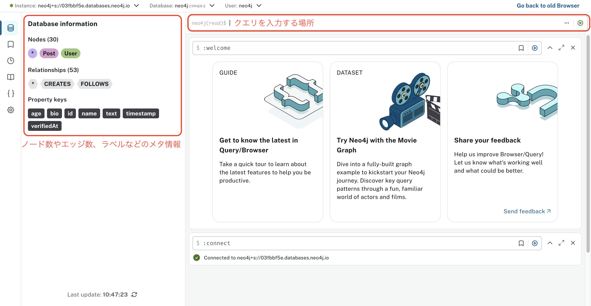
    <p><strong>図11：接続直後の画面</strong></p>
  </div>
</figure>

図12は、Cypherクエリを入力し、ある1つのノードを選択状態にした画面の例です。
実際に以下のクエリを入力して実行してみてください。このクエリは、全てのノードとエッジを取得します。

```cypher
MATCH (n)
OPTIONAL MATCH (n)-[r]->(m)
RETURN n, r, m
```

- 画面中央には、クエリの実行結果が表示されます。デフォルトでは可視化されたグラフが表示されます。
  - 色付きの丸がノード、矢印がエッジを表しています。
  - ノードやエッジはドラッグ操作で自由に移動できます。
   <u>複数のスキーマを比較する際に、ドラッグ操作でノードやエッジの位置を揃えると見やすくなります。</u>
- ノードやエッジをクリックすると、詳細情報が右側に表示されます。
  - 選択されたノードのラベルは`User`、プロパティは`{id: "u001", name: "Alice"}`であることがわかります。
  - ⚠️ <u>`<id>`はNeo4jが内部的に管理するノードIDであり、**今回のユーザスタディでは特に意味を持たないため無視してください。**</u>
- グラフが描画されている領域の左上のビューの切り替えボタンを操作することで、ビューの形式を変更できます。
  - `Table`ボタンを押すと、図13のようにテーブル形式で表示されます。

<figure style="margin: 0 10px;">
  <div align="center">
    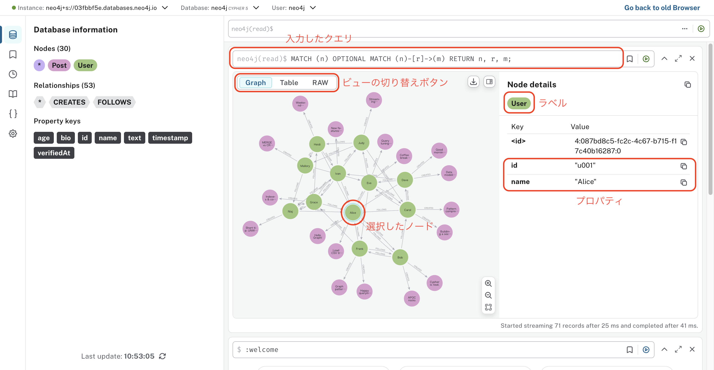
    <p><strong>図12：クエリを入力し、ノードを選択状態にした画面</strong></p>
  </div>
</figure>

<figure style="margin: 0 10px;">
  <div align="center">
    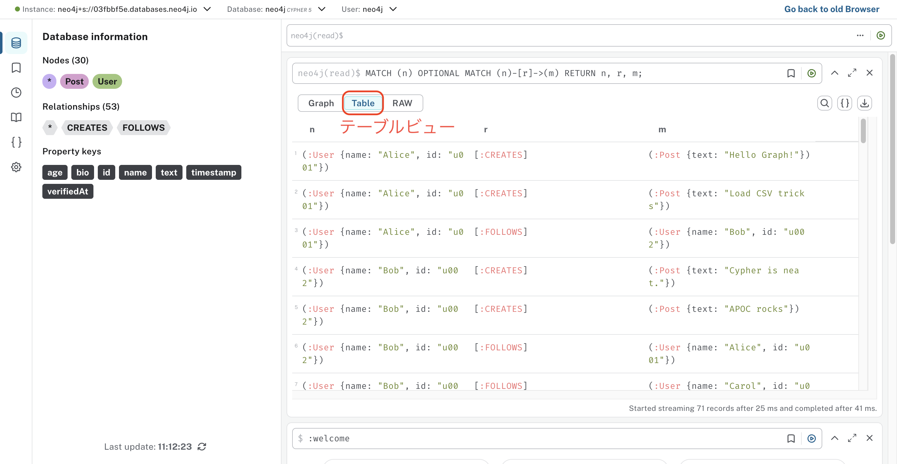
    <p><strong>図13：テーブルビュー</strong></p>
  </div>
</figure>

---
## 6. 評価の例

本来のタスクでは、各問題に対して1つのデータと4つのスキーマが提示され、それらを比較してどのスキーマが最も適切かを評価していただきます。しかしここでは簡単のため、この具体例では1つのデータと2つのスキーマを用いて説明します。

### データとスキーマの確認

まず、以下ような2つのノードと1つのエッジからなるシンプルなデータが与えられたとします。

ノード：
- ラベル`Person`、プロパティ`{name: "Alice", age: 22}`
- ラベル`Person`、プロパティ`{name: "Bob"}`

エッジ：
- ラベル`LIKES`、プロパティ`なし`

データをNeo4j上のインスタンスに格納すると、図14のようになります。

<figure>
  <div align="center">
    
    <p><strong>図14：データの例</strong></p>
  </div>
</figure>

このデータに対して、以下のような2つのスキーマA・Bが提示されたとします。
- スキーマ A（図15）
  - ノード型：必須ラベル`Person`、必須プロパティ`name`、<u>任意プロパティ`age`</u>
  - エッジ型：必須ラベル`LIKES`、プロパティなし、端点制約（始点ノード型`Person`、終点ノード型`Person`）
- スキーマ B（図16）
  - ノード型：必須ラベル`Person`、必須プロパティ`name`、<u>必須プロパティ`age`</u>
  - エッジ型：必須ラベル`LIKES`、プロパティなし、端点制約（始点ノード型`Person`、終点ノード型`Person`）

上記を見比べると、<u>両者の差は`age`プロパティが任意か必須かの違いだけ</u>であることがわかります。

<figure>
  <div align="center">
    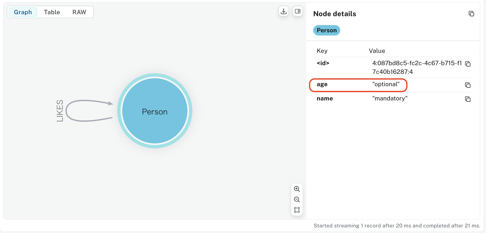
    <p><strong>図15:スキーマA</strong></p>
  </div>
</figure>
<figure>
  <div align="center">
    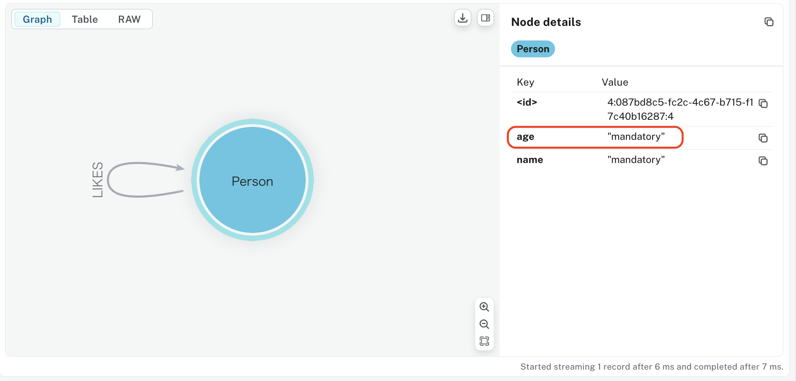
    <p><strong>図16:スキーマB</strong></p>
  </div>
</figure>

### スキーマの評価

まず、エッジ型`LIKES`は両スキーマとも同一のものでデータとも整合しているため、ここではノード型`Person`の評価に注目します。実際にデータを見ると、`Alice`ノードは`age`プロパティを持っていますが、`Bob`ノードは`age`プロパティを持っていません。
したがって、
- スキーマAは全てのノードに対して適切である
- スキーマBは`Bob`ノードに対して不適切である

と言えます。

よって、<u>スキーマAの方がスキーマBよりも適切であると評価できます。</u>

※ この評価の決め方はあくまで一例であり、必ずしもこの通りに実行する必要はありません。

---

## 7. Tips

### (1) Cypherチートシートのインポート

先ほどの具体例のデータは非常に小さいデータであったため、目視でノードのプロパティの必須・任意などを判断できました。
しかし、データが大きい場合は目視でそれらを判断するのが難しくなります。そのような場合に役立つのが **Cypherチートシート** です。
Cypherチートシートには、スキーマの評価に役立つ可能性がある様々なクエリがまとめられています。

#### Cypherチートシートのインポート手順

1. GitHubリポジトリから `cypher_cheat_sheet_XX.csv`をダウンロードします。（`XX = ja | en`）
2. 図17のようなNeo4jブラウザの画面左側にあるしおりのアイコン（①）をクリックし、次にアップロードアイコン（②）をクリックします。
   <figure>
    <div align="center">
      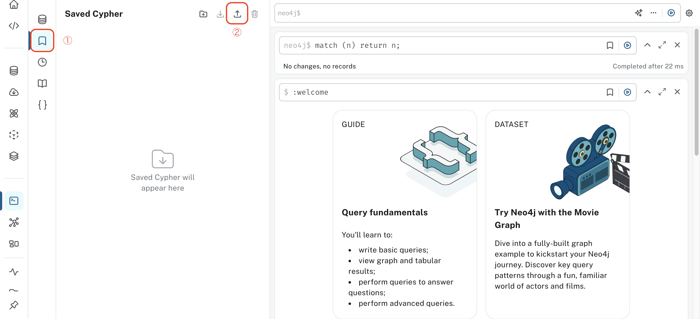
      <p><strong>図17：Neo4jブラウザの画面</strong></p>
    </div>
  </figure>

3. ファイル選択ダイアログが表示されるので、先ほどダウンロードした `cypher_cheat_sheet_XX.csv`を選択します。

4. 図18のように、インポートが完了した旨のダイアログが表示されれば成功です。
<figure>
  <div align="center">
    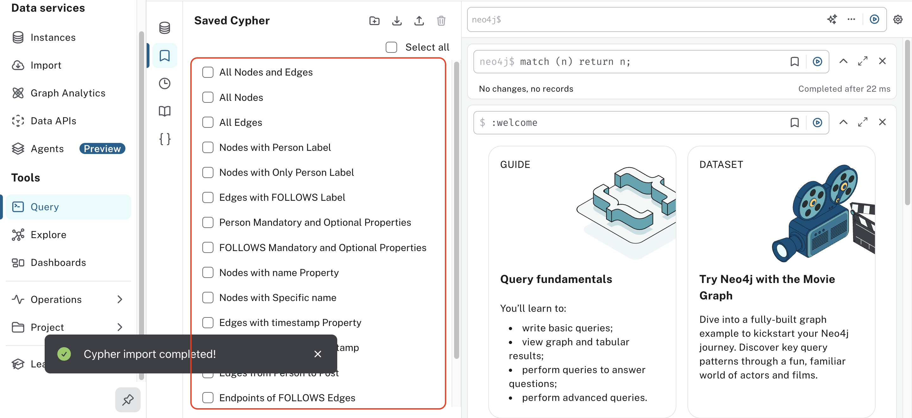
    <p><strong>図18：Cypherチートシートのインポート完了画面</strong></p>
  </div>
</figure>


#### Cypherチートシートの使用方法

図18の画面の特定のクエリをクリックすると、そのクエリがCypherクエリ入力欄に自動で挿入されます（図19）。
このようによく使うクエリを簡単に呼び出せるため、スキーマの評価に役立てることができます。

<figure>
  <div align="center">
    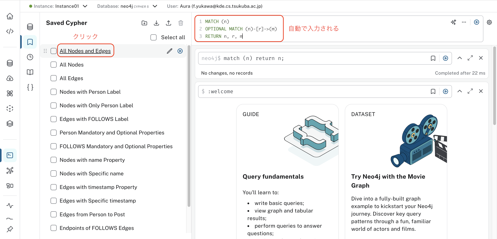
    <p><strong>図19：Cypherチートシートのインポート完了画面</strong></p>
  </div>
</figure>

#### 独自クエリの保存方法

ユーザごとに独自のクエリをブックマークすることもできます。
図20ようにクエリ入力欄の右上にある三点リーダーアイコンをクリックし、「Save cypher」を選択して、図21の画面にて任意の名前で保存してください。
すると、図22のように新たなクエリがSaved Cypherに追加されます。


<figure>
  <div align="center">
    
    <p><strong>図20</strong></p>
  </div>
</figure>

<figure>
  <div align="center">
    
    <p><strong>図21</strong></p>
  </div>
</figure>

<figure>
  <div align="center">
    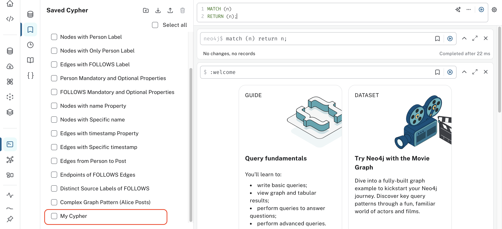
    <p><strong>図22</strong></p>
  </div>
</figure>

#### 補足

- Saved Cypherはユーザごとに独立しているため、好きに保存・削除して構いません。
- Neo4jブラウザを閉じてもSaved Cypherの内容は保持されます。

### (2) クエリ画面の複製

本ユーザスタディではデータとスキーマを見比べる必要がるため、実験中にはデータとスキーマの両方の画面を別々に開いておくと便利です。

そのためには、図23の画面（`console-preview.neo4j.io/projects/32a55722-3fdf-44b4-a148-878cd3dcc036/instances`）を複数のブラウザタブで開き、
図24のようにデータ（Q1-1など）やスキーマ（Q1-1-A, Q1-1-Bなど）を並べて表示しておくと取り組みやすいです。

<figure>
  <div align="center">
    
    <p><strong>図23</strong></p>
  </div>
</figure>


<figure>
  <div align="center">
    
    <p><strong>図24</strong></p>
  </div>
</figure>
